# PCI Platform — Entity-Relationship Diagrams

One diagram per domain, because a single diagram of 290 tables is a picture of nothing.
Generated from the live schema alongside the full column reference in
[`PCI_DATABASE_SCHEMA.md`](PCI_DATABASE_SCHEMA.md).

**How to read these**

- Solid `||--o{` — a **declared** foreign key. There are only 19 in the whole schema.
- Dotted `}o..o{` — an **inferred** relationship: a `<thing>_id` column pointing at a
  plausible table. Real in the code, **not enforced by the database**.
- Only join-bearing columns are drawn. Every column of every table is in the schema
  reference; repeating them here would make the diagrams unreadable.

> Because integrity is enforced in application code, the arrows tell you what the code
> intends — not what the database guarantees. Both facts matter when you write a migration
> or a manual fix.

---

## PCI World — community & moderation

*15 tables in this domain*

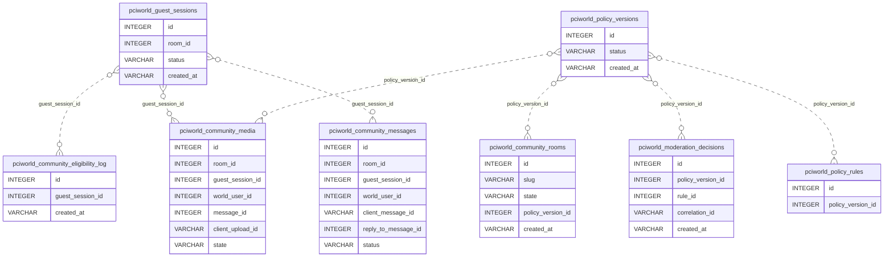

**Tables in this domain:** `pciworld_community_eligibility_log`, `pciworld_community_media`, `pciworld_community_messages`, `pciworld_community_outbox`, `pciworld_community_reports`, `pciworld_community_rooms`, `pciworld_guest_sessions`, `pciworld_media_scan_queue`, `pciworld_media_scans`, `pciworld_moderation_case_events`, `pciworld_moderation_cases`, `pciworld_moderation_decisions`, `pciworld_policy_rules`, `pciworld_policy_versions`, `pciworld_reports`

---

## PCI World — careers

*8 tables in this domain*

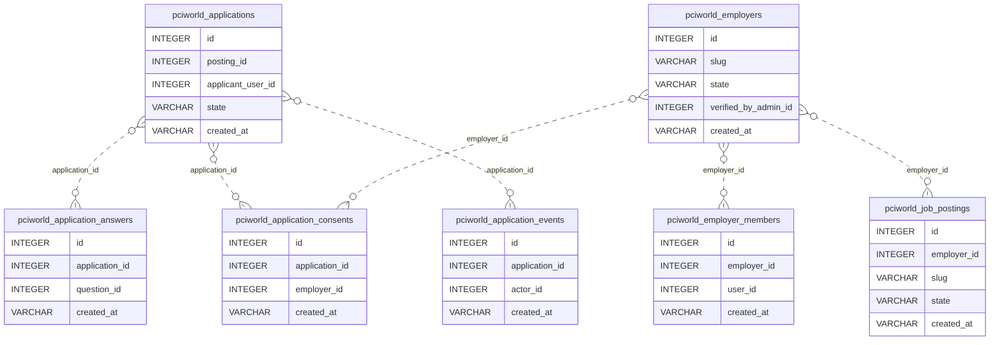

**Tables in this domain:** `pciworld_application_answers`, `pciworld_application_consents`, `pciworld_application_events`, `pciworld_applications`, `pciworld_employer_members`, `pciworld_employers`, `pciworld_job_postings`, `pciworld_job_questions`

---

## PCI World — editorial & contributors

*9 tables in this domain*

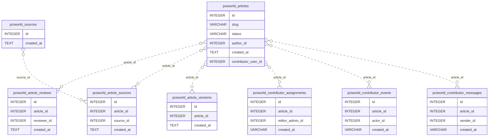

**Tables in this domain:** `pciworld_article_reviews`, `pciworld_article_sources`, `pciworld_article_versions`, `pciworld_articles`, `pciworld_contributor_assignments`, `pciworld_contributor_events`, `pciworld_contributor_messages`, `pciworld_contributors`, `pciworld_sources`

---

## PCI World — challenges, rotation & intelligence

*7 tables in this domain*

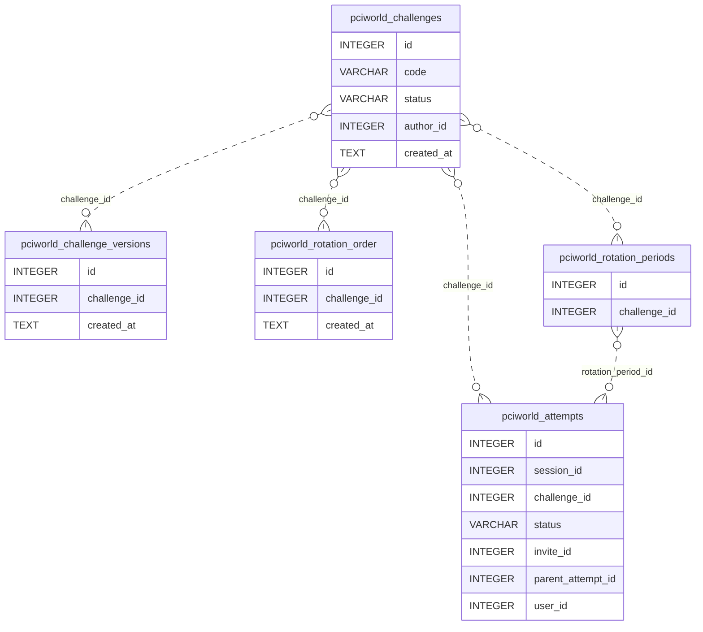

**Tables in this domain:** `pciworld_attempts`, `pciworld_challenge_versions`, `pciworld_challenges`, `pciworld_rotation_lock`, `pciworld_rotation_order`, `pciworld_rotation_periods`, `pciworld_rotation_runs`

---

## PCI World — identity, passport & admin

*23 tables in this domain*

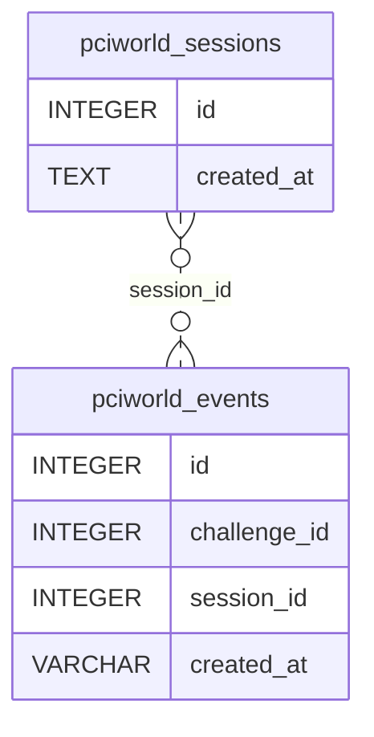

**Tables in this domain:** `pciworld_admin_sessions`, `pciworld_admin_users`, `pciworld_appeals`, `pciworld_audit`, `pciworld_calendar`, `pciworld_cv_access_log`, `pciworld_entities`, `pciworld_entity_mentions`, `pciworld_events`, `pciworld_handoff_codes`, `pciworld_invites`, `pciworld_oauth_clients`, `pciworld_oauth_codes`, `pciworld_participants`, `pciworld_referrals`, `pciworld_restricted_evidence`, `pciworld_risk_restrictions`, `pciworld_sanctions`, `pciworld_sessions`, `pciworld_user_map`, `pciworld_user_sessions`, `pciworld_user_tokens`, `pciworld_users`

---

## Students & identity

*22 tables in this domain*

```mermaid
erDiagram
    account_requests {
        INTEGER id
        INTEGER user_id
        TEXT status
        TEXT created_at
    }
    admin_sessions {
        INTEGER id
        INTEGER admin_id
        TEXT created_at
    }
    admin_users {
        INTEGER id
        TEXT email
        TEXT status
        TEXT created_at
    }
    candidate_consents {
        INTEGER id
        INTEGER user_id
    }
    enrollment_sessions {
        INTEGER id
        TEXT email
        INTEGER user_id
        TEXT created_at
    }
    fraud_flags {
        INTEGER id
        INTEGER code_id
        INTEGER user_id
        TEXT email
        VARCHAR status
        TEXT created_at
    }
    identity_checks {
        INTEGER id
        INTEGER attempt_id
        INTEGER user_id
        TEXT created_at
    }
    identity_documents {
        INTEGER id
        INTEGER user_id
        TEXT status
        TEXT created_at
    }
    impersonation_sessions {
        INTEGER id
        INTEGER admin_id
        INTEGER user_id
    }
    login_events {
        INTEGER id
        INTEGER user_id
        TEXT created_at
    }
    login_tokens {
        INTEGER id
        INTEGER user_id
        TEXT created_at
    }
    membership_upgrades {
        INTEGER id
        INTEGER user_id
        VARCHAR status
        TEXT created_at
    }
    memberships {
        INTEGER id
        INTEGER user_id
        TEXT status
        VARCHAR stripe_customer_id
        VARCHAR stripe_subscription_id
    }
    qualifications {
        INTEGER id
        INTEGER user_id
        TEXT created_at
    }
    security_events {
        INTEGER id
        INTEGER user_id
        TEXT created_at
    }
    student_profiles {
        INTEGER id
        INTEGER user_id
    }
    users {
        INTEGER id
        TEXT email
        TEXT status
        TEXT created_at
    }
    work_experiences {
        INTEGER id
        INTEGER user_id
        TEXT created_at
    }
    users }o..o{ account_requests : "user_id"
    admin_users ||--o{ admin_sessions : "admin_id"
    users }o..o{ candidate_consents : "user_id"
    users ||--o{ enrollment_sessions : "user_id"
    users }o..o{ fraud_flags : "user_id"
    users }o..o{ identity_checks : "user_id"
    users }o..o{ identity_documents : "user_id"
    users }o..o{ impersonation_sessions : "user_id"
    users }o..o{ login_events : "user_id"
    users ||--o{ login_tokens : "user_id"
    users }o..o{ membership_upgrades : "user_id"
    users ||--o{ memberships : "user_id"
    users }o..o{ qualifications : "user_id"
    users }o..o{ security_events : "user_id"
    users ||--o{ student_profiles : "user_id"
    users }o..o{ work_experiences : "user_id"
```

**Tables in this domain:** `account_requests`, `admin_reset_tokens`, `admin_sessions`, `admin_users`, `candidate_consents`, `enrollment_sessions`, `fraud_flags`, `identity_checks`, `identity_documents`, `impersonation_events`, `impersonation_sessions`, `login_events`, `login_tokens`, `membership_upgrades`, `memberships`, `pci_identity_merges`, `pci_student_number_registry`, `qualifications`, `security_events`, `student_profiles`, `users`, `work_experiences`

---

## Examinations & credentials

*31 tables in this domain*

```mermaid
erDiagram
    cert_document_downloads {
        INTEGER id
        INTEGER cert_document_id
        INTEGER user_id
        VARCHAR copy_id
        TEXT created_at
    }
    cert_document_versions {
        INTEGER id
        INTEGER cert_document_id
        INTEGER restored_from_id
        TEXT created_at
    }
    cert_documents {
        INTEGER id
        INTEGER certification_id
        TEXT created_at
    }
    certification_applications {
        INTEGER id
        INTEGER user_id
        INTEGER certification_id
        VARCHAR status
        TEXT created_at
    }
    certification_routes {
        INTEGER id
        INTEGER certification_id
        TEXT created_at
    }
    certifications {
        INTEGER id
        TEXT code
        TEXT created_at
        TEXT status
        TEXT slug
        VARCHAR credly_template_id
    }
    exam_attempt_grants {
        INTEGER id
        INTEGER authorization_id
        INTEGER user_id
        INTEGER certification_id
        INTEGER incident_id
        INTEGER payment_id
        TEXT status
    }
    exam_attempts {
        INTEGER id
        INTEGER user_id
        INTEGER booking_id
        INTEGER certification_id
        TEXT status
        INTEGER authorization_id
        INTEGER grant_id
    }
    exam_authorizations {
        INTEGER id
        INTEGER user_id
        INTEGER certification_id
        INTEGER payment_id
        INTEGER entitlement_id
        INTEGER institution_id
        TEXT status
    }
    exam_bookings {
        INTEGER id
        INTEGER user_id
        INTEGER payment_id
        INTEGER certification_id
        TEXT status
        TEXT created_at
        INTEGER authorization_id
    }
    exam_delivery_orders {
        INTEGER id
        INTEGER provider_id
        INTEGER user_id
        INTEGER booking_id
        INTEGER attempt_id
        INTEGER certification_id
        VARCHAR status
    }
    exam_entitlements {
        INTEGER id
        INTEGER user_id
        INTEGER payment_id
        INTEGER certification_id
        TEXT status
        INTEGER booking_id
        INTEGER attempt_id
    }
    exam_extension_history {
        INTEGER id
        INTEGER authorization_id
        INTEGER user_id
        INTEGER certification_id
    }
    exam_incidents {
        INTEGER id
        INTEGER user_id
        INTEGER certification_id
        INTEGER attempt_id
        INTEGER booking_id
        INTEGER authorization_id
        VARCHAR status
    }
    exam_reschedule_history {
        INTEGER id
        INTEGER booking_id
        INTEGER authorization_id
        INTEGER user_id
        INTEGER certification_id
        TEXT created_at
    }
    exam_score_snapshots {
        INTEGER id
        INTEGER attempt_id
        INTEGER user_id
        TEXT created_at
    }
    issued_credentials {
        INTEGER id
        TEXT credential_id
        INTEGER user_id
        INTEGER attempt_id
        INTEGER certification_id
        TEXT status
        VARCHAR credly_badge_id
    }
    sample_questions {
        INTEGER id
        INTEGER certification_id
    }
    cert_documents }o..o{ cert_document_downloads : "cert_document_id"
    cert_documents }o..o{ cert_document_versions : "cert_document_id"
    certifications }o..o{ cert_documents : "certification_id"
    certifications }o..o{ certification_applications : "certification_id"
    certifications }o..o{ certification_routes : "certification_id"
    certifications }o..o{ exam_attempt_grants : "certification_id"
    certifications ||--o{ exam_attempts : "certification_id"
    certifications }o..o{ exam_authorizations : "certification_id"
    certifications ||--o{ exam_bookings : "certification_id"
    certifications }o..o{ exam_delivery_orders : "certification_id"
    certifications ||--o{ exam_entitlements : "certification_id"
    certifications }o..o{ exam_extension_history : "certification_id"
    certifications }o..o{ exam_incidents : "certification_id"
    certifications }o..o{ exam_reschedule_history : "certification_id"
    exam_attempts ||--o{ exam_score_snapshots : "attempt_id"
    certifications ||--o{ issued_credentials : "certification_id"
    exam_attempts ||--o{ issued_credentials : "attempt_id"
    certifications ||--o{ sample_questions : "certification_id"
```

**Tables in this domain:** `bok_domains`, `cert_document_downloads`, `cert_document_versions`, `cert_documents`, `certificate_downloads`, `certification_applications`, `certification_routes`, `certifications`, `exam_attempt_grants`, `exam_attempts`, `exam_authorizations`, `exam_bookings`, `exam_delivery_log`, `exam_delivery_orders`, `exam_delivery_providers`, `exam_entitlements`, `exam_evidence`, `exam_extension_history`, `exam_incidents`, `exam_launch_codes`, `exam_readiness_checks`, `exam_reschedule_history`, `exam_score_snapshots`, `exam_window_rules`, `governance_roles`, `held_certifications`, `issued_credentials`, `practice_attempts`, `proctor_events`, `proctor_messages`, `sample_questions`

---

## Payments, finance & partners

*25 tables in this domain*

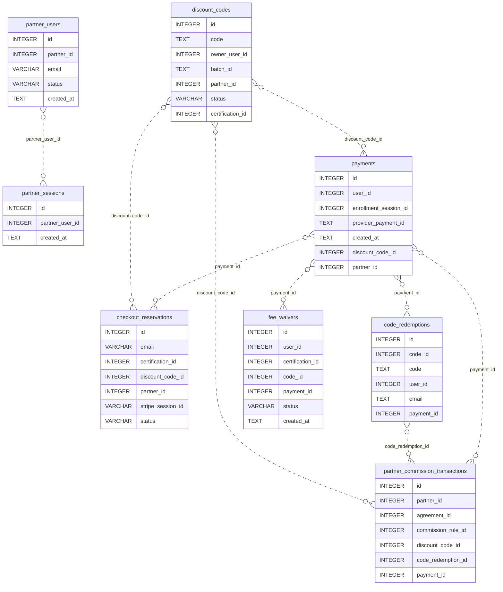

**Tables in this domain:** `checkout_reservations`, `code_redemptions`, `discount_codes`, `fee_waivers`, `partner_agreements`, `partner_campaign_links`, `partner_commission_events`, `partner_commission_rules`, `partner_commission_transactions`, `partner_dispute_messages`, `partner_disputes`, `partner_link_clicks`, `partner_notices`, `partner_payouts`, `partner_sessions`, `partner_settlement_items`, `partner_settlements`, `partner_sponsorships`, `partner_users`, `payments`, `pricing_rules`, `training_partner_application_documents`, `training_partner_applications`, `training_partners`, `webhook_events`

---

## Content, website & SEO

*40 tables in this domain*

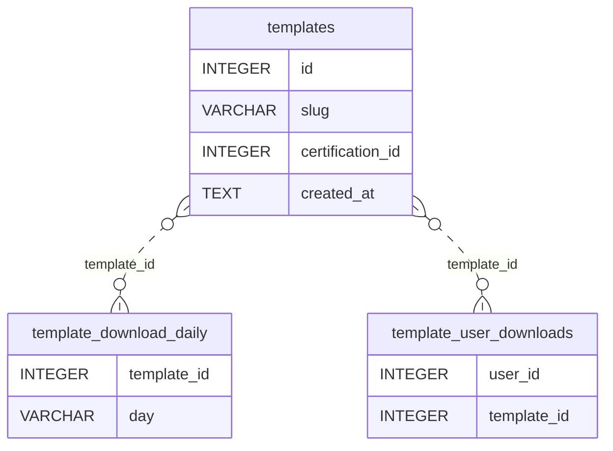

**Tables in this domain:** `ai_content_generations`, `ai_content_providers`, `blog_authors`, `blog_categories`, `blog_post_tags`, `blog_post_versions`, `blog_posts`, `blog_reviews`, `blog_tags`, `cc_analytics_metrics`, `cc_analytics_sources`, `cc_backlinks`, `cc_content_links`, `cc_external_items`, `cc_external_sources`, `cc_link_prospects`, `cc_outreach`, `cc_syndicated_posts`, `cc_syndication_destinations`, `content_capabilities`, `content_i18n`, `content_jobs`, `faqs`, `media_assets`, `nav_items`, `news`, `newsletter_subscribers`, `page_blocks`, `pages`, `public_document_downloads`, `public_documents`, `resources`, `reviews`, `seo_redirects`, `seo_submissions`, `site_content`, `site_settings`, `template_download_daily`, `template_user_downloads`, `templates`

---

## Support, casework & documents

*16 tables in this domain*

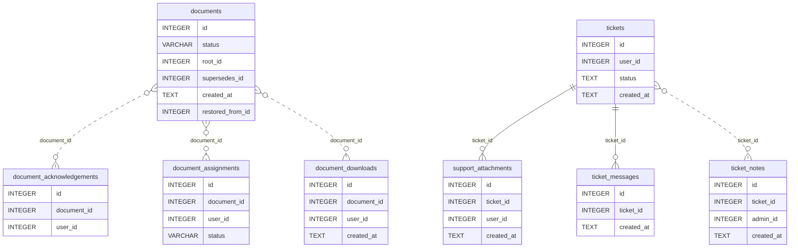

**Tables in this domain:** `accommodation_requests`, `appeals`, `cpd_declarations`, `cpd_entries`, `document_acknowledgements`, `document_assignments`, `document_categories`, `document_downloads`, `documents`, `erasure_requests`, `error_reports`, `support_attachments`, `support_templates`, `ticket_messages`, `ticket_notes`, `tickets`

---

## Events

*2 tables in this domain*

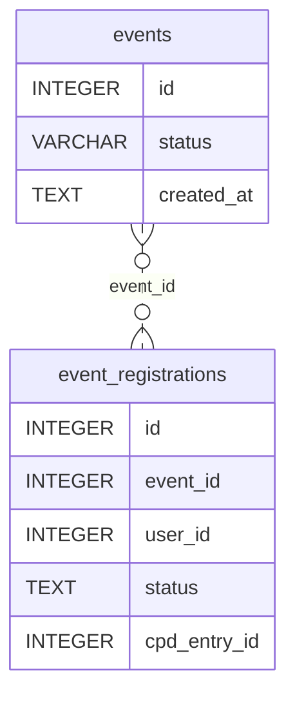

**Tables in this domain:** `event_registrations`, `events`

---

## Integrations & operations

*17 tables in this domain*

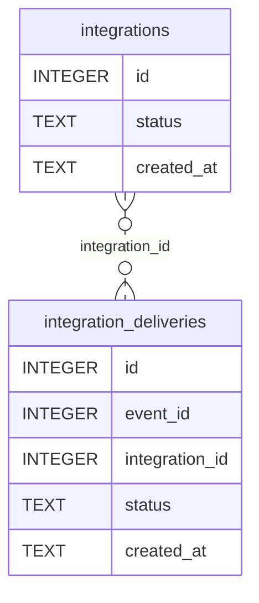

**Tables in this domain:** `audit_logs`, `career_email_templates`, `career_taxonomy`, `certuvo_accounts`, `founding_applications`, `honorary_application_documents`, `honorary_applications`, `honorary_awards`, `honorary_idv_documents`, `integration_deliveries`, `integration_events`, `integrations`, `job_app_events`, `job_applications`, `job_postings`, `job_questions`, `schema_migrations`

---
