# PCI Platform — Complete Developer Guide

**Scope:** every surface in this repository — the PCI Global marketing website, the student portal,
the operator dashboard, the examination pipeline, the Windows secure-exam client, and **PCI World**
(Passport, community rooms, forum, careers, contributor desk, Project Intelligence).

**Audience:** a developer who has never seen this codebase and has to understand it, extend it, and
take it live.

**Status of this document.** It was written by reading the code, not the older guides.
`backend/DEVELOPER_GUIDE.md` and `docs/PCI_DEVELOPER_GUIDE.md` are the same stale document and
predate PCI World entirely — they contain **zero** mentions of it, describe two React apps where
there are now four, and describe a schema roughly a quarter of its current size. Treat them as
history. Where this guide and they disagree, this guide was checked against the source.

**What this guide does not replace.** `docs/pciworld/` holds ~5,700 lines of phase-by-phase design
records (`CCP_PHASE0`–`CCP_PHASE6`, `EXPANSION_PHASE0`–`4`, `THREAT_MODEL`, `CCP_DECISION_LOG`,
`CCP_ISSUE_REGISTER`). This guide tells you what exists and how it fits; those tell you **why** each
rule was chosen and what was rejected. When you are about to change a safety rule, read the phase
document first — the reasoning is usually load-bearing.

---

## Table of contents

1. [The platform in one page](#1-the-platform-in-one-page)
2. [Deployment topologies](#2-deployment-topologies)
3. [Repository layout](#3-repository-layout)
4. [Request pipeline](#4-request-pipeline)
5. [Data access — `Db.cs`](#5-data-access-dbcs)
6. [Schema, migrations and seeds](#6-schema-migrations-and-seeds)
7. [Identity, authentication and sessions](#7-identity-authentication-and-sessions)
8. [Authorisation (RBAC)](#8-authorisation-rbac)
9. [Logging in — every surface, URL and credential](#9-logging-in-every-surface-url-and-credential)
10. [Dashboard reference](#10-dashboard-reference)
11. [PCI Global — the public website](#11-pci-global-the-public-website)
12. [PCI Global — the student portal](#12-pci-global-the-student-portal)
13. [PCI Global — the operator dashboard](#13-pci-global-the-operator-dashboard)
14. [The examination pipeline](#14-the-examination-pipeline)
15. [The secure-exam desktop client](#15-the-secure-exam-desktop-client)
16. [Payments and finance](#16-payments-and-finance)
17. [PCI World — concept and identity](#17-pci-world-concept-and-identity)
18. [PCI World — the Passport](#18-pci-world-the-passport)
19. [PCI World — challenges, rotation and scoring](#19-pci-world-challenges-rotation-and-scoring)
20. [PCI World — community rooms and moderation](#20-pci-world-community-rooms-and-moderation)
21. [PCI World — the forum and the trust ladder](#21-pci-world-the-forum-and-the-trust-ladder)
22. [PCI World — careers](#22-pci-world-careers)
23. [PCI World — contributors and editorial](#23-pci-world-contributors-and-editorial)
24. [PCI World — Project Intelligence](#24-pci-world-project-intelligence)
25. [PCI World — the World admin console](#25-pci-world-the-world-admin-console)
26. [The launch board — how World is switched on](#26-the-launch-board-how-world-is-switched-on)
27. [Cross-cutting services](#27-cross-cutting-services)
28. [Background workers](#28-background-workers)
29. [The API surface](#29-the-api-surface)
30. [The front-end applications](#30-the-front-end-applications)
31. [Local development](#31-local-development)
32. [Testing and CI](#32-testing-and-ci)
33. [Configuration reference](#33-configuration-reference)
34. [Deployment](#34-deployment)
35. [Go-live checklist](#35-go-live-checklist)
36. [How to extend the platform](#36-how-to-extend-the-platform)
37. [Where to look first](#37-where-to-look-first)
38. [Operations, observability and support tooling](#38-operations-observability-and-support-tooling)
39. [Backup, restore and disaster recovery](#39-backup-restore-and-disaster-recovery)
40. [Emergency runbooks, known issues and safety escalation](#40-emergency-runbooks-known-issues-and-safety-escalation)
41. [Subsystems this guide summarises rather than details](#41-subsystems-this-guide-summarises-rather-than-details)
42. [What this guide does not cover](#42-what-this-guide-does-not-cover)
43. [End-to-end flowcharts](#43-end-to-end-flowcharts)
44. [End-to-end checklists](#44-end-to-end-checklists)

---

## 1. The platform in one page

One ASP.NET Core 8 service and one database serve **two brands** across **four web surfaces** plus a
Windows desktop client.

### The two brands

| Brand | What it is | Primary domain |
|---|---|---|
| **PCI Global** (Project Controls Institute) | The certification body: marketing site, candidate journey, exams, credentials, CPD | `projectcontrolsinstitute.org` |
| **PCI World** | The practice product: daily challenges, a verifiable Passport, community rooms, forum, careers, contributor-written editorial | `/world` on the same deployment, **or its own host** |

They are not two codebases. They share the process, the database, the data layer and the migration
system. What separates them is **hostname routing** and **feature flags**, both described below.

### The four web surfaces

| Surface | URL | Rendering | Notes |
|---|---|---|---|
| Public website | `/` | Server-rendered static HTML + DB content injection | ~234 pages, SEO-critical |
| Student portal | `/app/` (React) and `/student.html` (classic) | SPA | 20 routes; the classic panel remains reachable |
| Operator dashboard | `/admin/` (React) and `/admin.html` (classic) | SPA | 61 sections in 16 groups |
| PCI World | `/world/*` (server-rendered) + `/world-app/*` (React) + `/world-admin` (React) | Hybrid | Public pages crawlable; logged-in app is a SPA |

### Scale (measured, not estimated)

| | |
|---|---|
| HTTP routes | **984** |
| Endpoint modules (`backend/Endpoints/*.cs`) | 71 |
| Core services (`backend/Core/*.cs`) | ~135 |
| Database tables on a fresh boot | **291** (75 from `schema.sql`, the rest from runtime installers; 71 are `pciworld_*`) |
| Static pages (`backend/wwwroot/*.html`) | 234 |
| Backend test files | 107 (1,662 unit tests) |
| React bundles | 4 |
| Transactional email templates | 12 |
| CI jobs | 12 |

### The rule that explains most of the design

**PCI World's community features ship switched off** — and be precise about which, because the
distinction matters on day one. Verified on a fresh boot:

| Setting | Seeds | Meaning |
|---|---|---|
| `world_enabled` | `'1'` | **World itself is on.** `/world` serves, the Passport works, challenges run |
| `world_rotation_enabled` | `'1'` | The daily rotation scheduler runs |
| `world_community_enabled` | `'0'` | Community rooms **off** |
| `pciworld_forum_enabled` | `'0'` | Forum **off** |
| `pciworld_careers_enabled` | `'0'` | Careers **off** |
| `pciworld_contributors_enabled` | `'0'` | Contributor desk **off** |
| `pciworld_community_images_enabled` | `'0'` | Room images **off** |

So a fresh deployment gives you a working PCI World with **no social surface**. That is the
intended posture, not a half-configured install. Three of the five refuse to switch on until a named
prerequisite is recorded, and **that refusal is enforced in the endpoint, not the UI** — see §26.

---

## 2. Deployment topologies

The same image supports three shapes. Pick one before you configure anything else.

### (a) Combined — everything on one host

The default. `projectcontrolsinstitute.org` serves the marketing site, `/app`, `/admin`, and
`/world`. Nothing extra to set.

### (b) Portal split — student panel on its own domain

`Core/PortalDomain.cs` (RES-013). The marketing site stays on the institute domain; the logged-in
student panel moves to its own (`mypci.org`).

```
PORTAL_BASE_URL = https://mypci.org        # preferred
PORTAL_HOSTS    = mypci.org,www.mypci.org  # additional hostnames
```

With neither set the feature is **off** and every link stays relative — identical to single-domain
behaviour. What the split buys:

- session cookies and storage never straddle two origins;
- the portal domain is marked `noindex`, so the logged-in surface cannot outrank marketing pages;
- marketing paths requested on the portal domain redirect back (and `/app` vice versa), so each page
  has exactly **one** canonical home rather than two competing copies in search results.

### (c) PCI World standalone — World on its own service

`PCIWorld/Dockerfile` builds an image with `PCIWORLD_ONLY=true` baked in: it serves `/world` and
`/world-admin` and **nothing else** — the Institute website and portals are unreachable on that
deployment.

| Variable | Effect |
|---|---|
| `PCIWORLD_ONLY` | Serve World exclusively |
| `PCIWORLD_STANDALONE` | Standalone posture |
| `PCIWORLD_HOSTS` | Hostnames that resolve to World |
| `PCIWORLD_ADMIN_HOSTS` | Hostnames that resolve to the World admin |
| `PCIWORLD_BASE_URL` | World's public origin (links, QR codes, Passport URLs) |

Boot posture for the standalone image, from `PCIWorld/README.md`: with no configuration it runs an
explicit SQLite bridge on an absolute `/data` path. **Mount the disk** or the boot log prints an
`EPHEMERAL STORAGE` banner and data resets on every deploy — acceptable for looking at the product,
never for inviting anyone in. Setting `MYSQL_HOST` (or `MYSQL_CONNECTION_STRING`) flips the image to
fail-closed MySQL, which is the production destination.

---

## 3. Repository layout

```
PCI/
├── backend/                  ASP.NET Core 8 Minimal API — the whole platform's server
│   ├── Program.cs            Boot, middleware, inline endpoints, module wiring (2,124 lines)
│   ├── Core/                 ~135 cross-cutting services
│   ├── Endpoints/            71 feature endpoint modules
│   ├── Data/                 Db.cs, Migrate.cs, ~30 schema installers and content packs
│   ├── wwwroot/              234 .html pages + classic panels + assets
│   ├── emails/               12 transactional HTML templates
│   ├── tests/                xUnit suite (107 files, 1,662 tests) + Python logic suites
│   ├── schema.sql            SQLite schema — SOURCE OF TRUTH (75 tables)
│   ├── schema.mysql.sql      Generated from schema.sql
│   └── tools/                sqlite_to_mysql.py
├── frontend/                 React 18 + TypeScript (Vite) — FOUR bundles
│   └── src/
│       ├── pages/            Student portal (20 routes)
│       ├── admin/            Operator dashboard (61 sections)
│       ├── world/            PCI World app (+ community, forum, careers, contributor sub-apps)
│       ├── worldadmin/       World admin console
│       ├── eventstaff/       Event check-in scanner (ships inside the admin bundle)
│       └── components/, api/, auth/, i18n/
├── secureexam/               .NET 8 Windows WPF secure-exam client + Core + companion server
├── PCIWorld/                 Dockerfile + README for the World-only deployment
├── docs/
│   └── pciworld/             ~5,700 lines of World design records — read before changing rules
├── Dockerfile                Multi-stage: 4 React builds → .NET publish → runtime
├── render.yaml               Render Blueprint
└── .github/workflows/build.yml   12-job CI
```

> **`docs/` outside `docs/pciworld/` is a historical archive.** `ARTIFACT_MANIFEST.md` and
> `PCI_MASTER_INDEX.md` reference zip bundles that are not the working source. The live code is
> `backend/`, `frontend/`, `secureexam/`.

---

## 4. Request pipeline

Registered outermost-first in `Program.cs`, so **every** response carries the right headers. Order
matters; changing it is a behavioural change.

1. **Security headers + CSP** — `X-Content-Type-Options`, `Referrer-Policy`, `X-Frame-Options`,
   `Cross-Origin-Opener-Policy`, a scoped `Content-Security-Policy`, and HSTS when the
   TLS-terminating proxy reports `X-Forwarded-Proto: https` (matched against the **first** proxy
   hop). `CSP_REPORT_ONLY=true` runs the policy in report-only mode.
2. **CORS** — reflects `ALLOWED_ORIGIN` only; a wildcard is rejected in production. Handles the 204
   preflight.
3. **Rate limiting** — in-memory fixed window (10 req / 60 s) on brute-forceable POST paths:
   `/api/login`, `/api/admin/auth/login`, `/api/forgot-password`, `/api/validate-code`,
   `/api/set-password`, `/api/exam/authorize`. Keyed on the first `X-Forwarded-For` hop.
4. **Boot-time config validation** — in `Production` the app logs every issue and **exits 78** on a
   hard blocker (§33).
5. **Host routing** — PCI World / portal-domain resolution (`PortalDomain`, `PCIWORLD_HOSTS`).
6. **Maintenance mode** — a 503 holding page for public pages while `/api/*` and admin stay up.
7. **Dynamic content injection (Stage 2)** — before static files (§11).
8. **Static files** — `UseDefaultFiles` + `UseStaticFiles` over `wwwroot/`.
9. **SPA fallback (Stage 3)** — terminal middleware returning the `/app`, `/admin`, `/world-app` or
   `/world-admin` shell for extension-less client-side routes. Real assets and `/api/*` never reach
   it.

---

## 5. Data access — `Db.cs`

**All database access goes through the shared `Db` singleton. Never open your own connection.**

### Dual provider

SQL is written in **SQLite dialect — the source of truth**. When `DB_PROVIDER=mysql`, `Db.Translate`
rewrites it to MySQL/MariaDB at runtime: datetime maths, upserts, `last_insert_rowid()`, `changes()`,
`julianday`, `strftime`, partial unique indexes. Application code stays provider-agnostic.

### Datetimes are strings

`YYYY-MM-DD HH:MM:SS` (UTC) on **both** providers, so all string-based date logic
(`H.JsMillis` / `H.IsPast` / `H.After`) is identical everywhere.

> Compare instants through those helpers, **never** lexically. `' '` (0x20) sorts below `'T'` (0x54),
> which produces off-by-a-day bugs that only appear on one provider.

### API surface

| Method | Returns |
|---|---|
| `Query` / `QueryOne` | `Dictionary<string,object?>` rows, case-insensitive keys |
| `Scalar<T>` | single value |
| `Execute` | rows affected |
| `ExecuteReturningId` | inserted id |
| `ExecuteWithChanges` | atomic (id, changes) — used by the Stripe webhook idempotency gate |
| `Transaction(Action)` | wrapped unit of work |
| `Columns(table)` | live column list |
| `AddColumn(table, column, ddl)` | idempotent `ALTER TABLE ADD COLUMN` |
| `WithRetryOnLockFailure(body)` | retry for deadlock / lock-wait timeout |

Parameters use positional `?`, rewritten to `@p0, @p1, …` in `Bind`. **Always parameterise.**

Read column values through the `H` coercion helpers (`H.L` / `H.D` / `H.Str` / `H.B`) — they hide the
provider's object typing.

### Two concurrency helpers you must understand before writing an installer

**`Db.AddColumn`** replaces eleven hand-rolled check-then-act copies. Neither SQLite nor MySQL 8 has
`ADD COLUMN IF NOT EXISTS`, so it swallows the failure **only** when the column is present on
re-read. A bad type or a wrong table still throws — that is the difference between this and wrapping
the `ALTER` in a bare `catch`.

**`Db.WithRetryOnLockFailure`** retries what the database itself calls retryable, matched on the
provider's **error number** (InnoDB 1213 deadlock / 1205 lock-wait; SQLite 5 `BUSY` / 6 `LOCKED`) —
not on message text, which is localised and reworded between server versions.

> **Why both exist.** Making writes idempotent removes *duplicate-key* races and does nothing about
> *deadlocks*: concurrent connections inserting into the same tables still take locks in an order
> InnoDB can find a cycle in. Two hazards, two answers. `WithRetryOnLockFailure` is safe **only**
> for idempotent work, because a retry runs the block again.

---

## 6. Schema, migrations and seeds

### The two-tier schema

| Tier | Where | Count |
|---|---|---|
| Base | `backend/schema.sql` (→ `schema.mysql.sql`) | 75 tables |
| Runtime installers | `Data/*Schema.cs`, run at boot | remainder |

**290 tables on a fresh boot**, carrying **3,701 columns**, **336 indexes** and — read this twice —
only **19 declared foreign keys**.

> **Referential integrity is maintained by application code, not enforced by the database.** Nineteen
> constraints across two hundred and ninety tables means the relationships are real but unpoliced:
> delete a `users` row directly with SQL and you will orphan rows across dozens of tables. This is
> the single most important thing to know before writing a migration or a manual data fix.

Two generated companion documents carry the full detail, both produced from a freshly migrated
database rather than written by hand:

| Document | Contents |
|---|---|
| [`PCI_DATABASE_SCHEMA.md`](PCI_DATABASE_SCHEMA.md) | **Every table, every column** — type, nullability, default, primary key, and declared or inferred relationship — plus every index, grouped into 16 domains |
| [`PCI_DATABASE_ERD.md`](PCI_DATABASE_ERD.md) | **17 entity-relationship diagrams** — one per domain, with cross-domain anchor tables drawn in, distinguishing declared foreign keys from inferred ones |

Regenerate both with `gen_schema.py` against a fresh database after any schema change.

By family:

| Prefix | Tables | Area |
|---|---|---|
| `pciworld_` | 71 | All of PCI World |
| `mkt_` | 26 | Marketing centre, campaigns, ads |
| `exam_` | 16 | Examination pipeline |
| `partner_` | 15 | Training/marketing partners, commission, settlement |
| `comm_` | 13 | Communications centre |
| `cc_` | 10 | Content centre |
| `blog_`, `social_`, `simulation_` | 6–7 each | Editorial, social publishing, Simulation Lab |
| `job_`, `honorary_`, `document_` | 4 each | Careers, honorary fellows, document store |
| `forum_`, `training_`, `email_`, `content_`, `chat_`, `cert_`, `admin_` | 3 each | |

### Migrations — `Data/Migrate.cs`

Runs on **every boot** and is **idempotent**: loads `schema.sql` (or `schema.mysql.sql`), then
`CREATE TABLE IF NOT EXISTS` / `Db.AddColumn` for upgrades, `CREATE ... INDEX IF NOT EXISTS`, then
first-run seeds (bootstrap owner admin, demo student, content via `SeedContent`). Safe to re-run;
never overwrites edited content.

### The migration lock — do not work around it

`Migrate.Run` holds a **cross-instance lock** while it does DDL, and the runtime installers
registered in `Program.cs` (Comms, Marketing, SimLab, Templates, World, Finance) run **under the
same lock**.

> **Why this is not optional.** A zero-downtime deploy starts the replacement instance *before*
> stopping the old one, so on every deploy two processes run that block against one database. Each
> installer is wrapped in a `try/catch` that logs and continues, which makes the failure quiet
> rather than loud: the loser does not crash, it **abandons the rest of its upgrade**, and the
> deployment comes up with a half-migrated schema that fails later at a query far from the cause.
> If you add an installer, register it inside the lock.

### Changing the schema — the four steps

1. Edit `backend/schema.sql` (source of truth).
2. Add the idempotent upgrade in `Data/Migrate.cs` (`CREATE TABLE IF NOT EXISTS` / `Db.AddColumn`),
   so existing databases converge.
3. Regenerate the MySQL schema: `python3 tools/sqlite_to_mysql.py`.
4. Run the Python logic suites **and** the MySQL parity run.

---

## 7. Identity, authentication and sessions

There are **several independent bearer-token session systems**. They use different storage keys and
never share tokens. Tokens are stored **hashed** (`Security.Sha`); logout deletes the row.

| Principal | Login endpoint | Table | Lifetime |
|---|---|---|---|
| Student | `POST /api/login` | `login_tokens` | 30 days |
| Platform admin | `POST /api/admin/auth/login` | `admin_sessions` | 12 hours |
| PCI World user | World account endpoints | `pciworld_user_sessions`, `pciworld_user_tokens` | — |
| World admin | World admin auth | `pciworld_sessions` | — |
| Partner | Partner portal | `partner_sessions` | — |
| Enrolment flow | checkout | `enrollment_sessions` | short |
| Impersonation | admin support tooling | `impersonation_sessions` | audited |

Revocation ledgers: `revoked_pci_sessions`, `revoked_world_sessions`.

Passwords are **BCrypt** (`BCrypt.Net-Next`). `Security.VerifyPassword` returns `false` — never
throws — on a malformed stored hash, so a corrupt row yields a 401 rather than a 500.

### Canonical identity — `Core/WorldIdentity.cs`

The single most important identity rule in the codebase.

**Target model:** the platform's `users` table is the **only** student credential authority, and
`student_profiles` the only canonical student profile. PCI World keeps a product-**participation**
record per canonical user (`pciworld_participants`) — World status, onboarding state, goal,
preferences, timestamps — and **never** a second email, password hash, MFA secret or copied
professional profile.

**Legacy:** `pciworld_users` is a separate credential table (own email + bcrypt hash), linked to a
student at best via `student_user_id`. `WorldIdentity` installs the bridge tables and runs a
**reversible** legacy → canonical mapping:

| Rule | Behaviour |
|---|---|
| `LINKED` | A World row with a valid `student_user_id` maps to exactly that `users.id`. |
| `CREATED` | An unlinked World row whose email matches no canonical user creates one canonical `users` + `student_profiles` pair, **preserving the bcrypt hash** so the person's one password works on both products. The canonical PCI Student Number is issued here. |

Conflicts are **quarantined in the map, never silently merged**. The pass runs on every boot inside a
`try/catch` that logs — a mapping failure must not stop the deployment.

Related: `Core/IdentityMerge.cs`, `Core/StudentNumbers.cs`, `Core/StudentNumberBackfill.cs`, and the
admin sections *Identity & Student Numbers* and *Identity merges*.

---

## 8. Authorisation (RBAC)

`Core/Security.cs` → `Rbac`. **128 distinct permission keys**.

### Section groups

Four: `platform`, `website`, `student`, `exam`.

### Roles

| Role | Grants |
|---|---|
| `owner` | everything |
| `website_manager` | `Sections["website"]` + `overview` |
| `student_manager` | `Sections["student"]` + `overview` |
| `exam_manager` | `Sections["exam"]` + `overview` + `ex_view`, `ex_extend`, `ex_reopen`, `ex_reschedule`, `ex_restore`, `ex_incidents`, `ex_invalidate`, `ex_bulk` |
| `viewer` | read-only |
| `custom` | explicit permission set |

Plus **per-admin extra permissions** on top of the role.

Permission families include: examination exceptions (`ex_*` — `ex_approve`, `ex_correct_result`,
`ex_grant_replacement`, `ex_waive_exam`, `ex_waive_resched`, `ex_waive_retake`, `ex_waive_wait`, …),
content centre (`cc_*` — `cc_author`, `cc_review`, `cc_publish`, `cc_seo`, `cc_social`,
`cc_syndicate`, `cc_legal`, `cc_archive`, …), events (`events_*`), plus `audit`, `finance`,
`governance`, `credentials`, `documents`, `emails`, `enrollments`, `comms`.

### Gating endpoints

| Helper | Rule |
|---|---|
| `GateFn(req, section, ok)` | 403 unless owner or holds `section` |
| `OwnerGate` | owner-only (Team & Access, launch board) |

**Settings PATCH is deny-by-default by key prefix:** `web_` → `set_web`, `sp_` → `set_sp`,
`exam_` → `set_exam`, anything else → owner `settings`.

---

## 9. Logging in — every surface, URL and credential

This is the section to read first if you have just deployed and cannot get in.

### 9.1 Every login surface

| # | Surface | Login URL | Principal | Session table |
|---|---|---|---|---|
| 1 | **Operator dashboard** (React) | `/admin/` → login screen | Platform admin | `admin_sessions` |
| 2 | Operator dashboard (classic) | `/admin.html` | Platform admin | `admin_sessions` |
| 3 | **Student portal** (React) | `/app/login` | Student | `login_tokens` |
| 4 | Student portal (classic) | `/student.html` | Student | `login_tokens` |
| 5 | Student registration | `/app/register` | — | — |
| 6 | **PCI World** (app) | `/world-app/` — sign in / create account | World user | `pciworld_user_sessions` |
| 7 | PCI World (server-rendered) | `/world` → `/world/account` | World user | `pciworld_user_sessions` |
| 8 | World password reset | `/world/reset-password` | World user | — |
| 9 | World email verification | `/world/verify-email` | World user | — |
| 10 | **World admin console** | `/world-admin` | World admin | `pciworld_sessions` |
| 11 | **Partner portal** | partner portal route (`/api/partner/*`) | Partner | `partner_sessions` |
| 12 | **Employer portal** (careers) | `/world-app/` → *Employer portal* | Verified employer | World session |
| 13 | **Event check-in scanner** | `/admin/event-scanner` | Platform admin (event perms) | `admin_sessions` |
| 14 | Exam preview | `/exam-ui.html` | — | — |
| 15 | Secure-exam desktop client | `pciexam://` launch URI | Single-use launch code | — |

The portal domain split (§2) moves #3–#5 onto their own hostname when `PORTAL_BASE_URL` is set; the
World-only deployment (§2) serves only #6–#10.

### 9.2 Seeded accounts and their default passwords

These are **development defaults committed to this repository**. Anyone who can read the repo knows
them, so treat every one as public until changed.

| Account | Default email | Default password | Set by | Seeded when |
|---|---|---|---|---|
| **Platform owner admin** | `owner@pci.local` | `changeme-owner` | `ADMIN_OWNER_EMAIL` / `ADMIN_OWNER_PASSWORD` | First boot, if `admin_users` is empty |
| **Demo student** | `student@pci.local` | `changeme-student` | `DEMO_STUDENT_EMAIL` / `DEMO_STUDENT_PASSWORD` | **Non-production only**, or when `DEMO_STUDENT_PASSWORD` is explicitly set |
| **PCI World owner admin** | `owner@pciworld.local` | see below — **not a fixed default in production** | `PCIWORLD_OWNER_PASSWORD` | First boot, if `pciworld_admin_users` is empty |
| Secure-exam demo | — | launch code `PCIDEMO12345` | — | Demo/reference server only |

**The platform owner is forced to change its password at first login** (`must_change_pw`). Readiness
reports whether that has happened:

```
GET /api/admin/system-check   →   owner_password_changed: true | false
```

Boot also warns while the default is still in place:

```
[config] ADMIN_OWNER_PASSWORD — bootstrap owner uses the default password until changed
```

### 9.3 The World admin password — the one that behaves differently

Read this before you go looking for `changeme-world-owner` in a production log and fail to find it.

> **A published default password is a published credential.** The World admin holds publication
> rights over every challenge, so a production install must never boot with one an attacker can read
> in this repository.

So the behaviour is posture-dependent:

| Posture | `PCIWORLD_OWNER_PASSWORD` set? | What happens |
|---|---|---|
| Development / E2E | no | Uses the well-known default `changeme-world-owner`, so the suites stay deterministic |
| **Production** | no | **A random password is minted and printed ONCE** to the deploy log |
| Any | yes | Uses your value |

The one-time line to search your deploy log for:

```
[seed] PCI World owner admin created: owner@pciworld.local — ONE-TIME PASSWORD: <random hex>
```

When you supplied the password yourself, the line instead reads:

```
[seed] PCI World owner admin created: owner@pciworld.local — change the password after first sign-in
```

**The announcement fires only when the row was really inserted.** That precision is deliberate: it
prints a credential an operator reads out of the log, and after a lost race that password would have
belonged to no account — sending someone to a sign-in screen that rejects the credential the log told
them was correct.

**If you missed the line**, the password is not recoverable — it was never stored in plaintext. Set
`PCIWORLD_OWNER_PASSWORD` and redeploy onto an empty `pciworld_admin_users` table, or reset through
the platform's recovery path (`ADMIN_OWNER_RESET_PASSWORD`, `ADMIN_RECOVERY_CODE`).

### 9.4 Why the bootstrap seed is guarded the way it is

`WorldSchema` seeds the owner behind a `COUNT` guard **and** an `OR IGNORE`, and both are needed:

- **The `COUNT` guard is the policy** — bootstrap only into an empty table. An operator who renamed
  or replaced the bootstrap owner must not have `owner@pciworld.local` quietly re-created underneath
  them on the next boot, **with the published development password**. Keying idempotency on the email
  alone would do exactly that.
- **The `OR IGNORE` closes the race** inside the guard, so two concurrent installers cannot both pass
  `COUNT = 0` and have the second die on a duplicate key.

### 9.5 Credential hygiene before go-live

- [ ] Platform owner password changed (`owner_password_changed: true`)
- [ ] `ADMIN_OWNER_EMAIL` set to a real address you control
- [ ] World owner password changed at first sign-in
- [ ] Demo student **not** seeded in production (leave `DEMO_STUDENT_PASSWORD` unset)
- [ ] `ENABLE_LEGACY_ADMIN_TOKEN` unset — the app refuses to boot with it on in production
- [ ] Every salt and secret in §33 set to a real random value
- [ ] Additional admins created with least-privilege roles rather than sharing the owner account

---

## 10. Dashboard reference

Four distinct operator/user consoles. They do not share sessions, permissions or storage keys.

### 10.1 The operator dashboard — 61 sections

`/admin/` (React) or `/admin.html` (classic). Every row is RBAC-gated by the permission shown; a
blank permission means the section is **owner-only** or gated inside the page rather than by the nav.
`owner` sees everything.

**Overview**

| Route | Section | Permission |
|---|---|---|
| `/` | Dashboard | — |
| `/reports` | Reports | `reports` |

**Students**

| Route | Section | Permission |
|---|---|---|
| `/students` | Students | `members` |
| `/enrollments` | Enrolments | `enrollments` |
| `/payments` | Payments | `payments` |
| `/tickets` | Support tickets | `tickets` |
| `/casework` | Appeals & accommodations | `tickets` |
| `/cpd-review` | CPD review | `members` |
| `/documents` | Documents | `documents` |
| `/books` | Books & materials | `resources` |
| `/membership-grades` | Membership grades | `members` |
| `/member-directory` | Member directory | `members` |
| `/identity-merges` | Identity merges | `id_read` |
| `/erasure-requests` | Data erasure requests | `members` |

**Support**

| Route | Section | Permission |
|---|---|---|
| `/communications` | Communications Centre | `comms` |
| `/support-inbox` | Support inbox | `inbox` |
| `/errors` | Error reports | `inbox` |

**Examinations**

| Route | Section | Permission |
|---|---|---|
| `/certifications` | Certifications | `exams` |
| `/exams` | Exam registrations | `exams` |
| `/proctoring` | Proctoring & sessions | `proctoring` |
| `/exam-exceptions` | Exam Exceptions | `ex_view` |
| `/exam-delivery` | Exam delivery vendors | `exam_delivery` |
| `/credentials` | Credentials | `credentials` |
| `/lab` | Simulation Lab | `sim_lab` |

**Access & pricing**

| Route | Section | Permission |
|---|---|---|
| `/codes` | Discount codes | `codes` |
| `/founding` | Founding stage | — |
| `/honorary` | Honorary fellows | — |
| `/honorary-applications` | Honorary applications | — |

**Website**

| Route | Section | Permission |
|---|---|---|
| `/content-centre` | Content & Distribution | `cc_view` |
| `/pages` | Pages & content | `pages` |
| `/public-downloads` | Downloads Centre | `documents` |
| `/templates` | Free templates | `content` |
| `/content` | Site content | `content` |
| `/announcement` | Announcement | `content` |
| `/translations` | Translations | — |
| `/reviews` | Reviews | `content` |

**Community**

| Route | Section | Permission |
|---|---|---|
| `/forum-moderation` | Forum moderation | `content` |
| `/events` | Events & webinars | `content` |
| `/careers` | Careers / jobs | `content` |

**Marketing, SEO, Analytics, AI**

| Route | Section | Permission |
|---|---|---|
| `/social` | Social media | `social` |
| `/marketing` | Marketing dashboard | — |
| `/marketing-ads` | Marketing, Ads & Search Console | `mkt_view` |
| `/seo` | SEO | `pages` |
| `/analytics` | Analytics | `reports` |
| `/ai-visibility` | AI Visibility | `pages` |

**Partners & integrations**

| Route | Section | Permission |
|---|---|---|
| `/training-partners` | Training Partners | `partners` |
| `/marketing-partners` | Marketing Partners | `partners` |
| `/partner-finance` | Partner Finance | `partners` |
| `/integrations` | Integrations & ERP | `integrations` |

**PCI World**

| Route | Section | Permission |
|---|---|---|
| `/world-launch` | PCI World launch | — (**owner only**, enforced server-side) |

**Operations**

| Route | Section | Permission |
|---|---|---|
| `/enquiries` | Enquiries | `inquiries` |
| `/submissions` | Form submissions | `submissions` |
| `/subscribers` | Newsletter | `subscribers` |
| `/emails` | Email log | `emails` |
| `/audit` | Audit log | `audit` |
| `/identity` | Identity & Student Numbers | — |
| `/event-scanner` | Event check-in scanner | — |
| `/notifications` | Notifications | `content` |
| `/readiness` | Readiness | — (owner) |
| `/settings` | Settings | — (deny-by-default by key prefix) |
| `/team` | Team & Access | — (**owner only**) |

> **The nav is not the security boundary.** Hiding a section does not protect it — every one of these
> is re-checked server-side by `GateFn` / `OwnerGate` on each API call. If you add a section, gate the
> endpoint; the nav entry is a convenience.

### 10.2 The World admin console

`/world-admin` (operator-visited route; asset base `/world-admin-app/`). Separate identity
(`pciworld_admin_users`), separate sessions (`pciworld_sessions`), separate audit trail
(`pciworld_audit`). **80 routes** under `/api/world-admin`:

| Group | What it manages |
|---|---|
| `overview` | Console landing metrics |
| `participants` | `pciworld_participants` — World participation records |
| `users` | World user accounts |
| `challenges` | The challenge bank |
| `rotation` | Rotation cycles, periods and scheduler runs |
| `articles` | Manuscripts and versions |
| `editorial` | Workflow, approvals, corrections, sources |
| `community` | Rooms, moderation policy, cases |
| `forum` | Threads, posts, trust levels |
| `careers` | Employers, verification, postings, applications |
| `intelligence` | Project Intelligence taxonomy and bank |
| `calendar` | Scheduling |
| `reports` | Reporting |
| `audit` | Append-only World audit |
| `auth` | World admin authentication |
| `oauth-clients` | OAuth client registration |

### 10.3 The PCI World user app

`/world-app/` — a React shell that **always returns 200** and gates each section on the API. Views:

| View | Requires | Notes |
|---|---|---|
| Practice Passport | — | Results, sharing, verification links |
| Your account / Settings | — | Profile, preferences, sharing controls |
| Sharing | — | Per-item **and per-field** publication consent |
| Community | `world_community_enabled` | Rooms; API 404s while off |
| Forum | `pciworld_forum_enabled` | Also server-rendered at `/world/forum` |
| Employer portal | `pciworld_careers_enabled` | **Verified employers only** |
| My job applications | `pciworld_careers_enabled` | Candidate side |
| Write for PCI World | `pciworld_contributors_enabled` | Contributor desk |

Public, crawlable World routes (no login): `/world`, `/world/about`, `/world/archive`,
`/world/challenge/{code}`, `/world/blog[/{slug}]`, `/world/news[/{slug}]`, `/world/p/{token}`
(Passport), `/world/p/{token}/photo`, `/world/verify`, `/world/r/{token}`, `/world/i/{token}`,
`/world/preview`, and — when switched on — `/world/forum` and `/world/careers`.

### 10.4 The student portal

`/app/` — 20 routes, listed in §12. Token key `pci.session.token`, stored in `sessionStorage` and
cleared on tab close (deliberate for shared machines).

### 10.5 Storage keys — why sessions never bleed across consoles

Each app has its own client from `makeClient(tokenKey)` and its own key:

| App | Token key |
|---|---|
| Student portal | `pci.session.token` |
| Operator dashboard | `pci.admin.token` |
| PCI World | World client key |
| World admin | World admin client key |

Signing into the dashboard therefore does **not** sign you into World, and signing out of one leaves
the others alone. A central 401 handler in each client clears its own token and redirects to that
app's login.

---

## 11. PCI Global — the public website

234 static pages, editable without a redeploy.

### Page families

| Family | Pages |
|---|---|
| `chapter-*` | 25 |
| `knowledge-*` | 14 |
| `blog-*` | 12 |
| `sector-*` | 10 |
| `membership-*` | 10 |
| `project-*` | 8 |
| `certification-*` | 8 |
| `student-*`, `ai-*` | 5 each |
| `exam-*`, `event-*` | 4 each |
| `route-*`, `examination-*`, `cpd-*` | 3 each |

### How injection works (Stage 2)

- `PageContent.SeedFromFiles` captures each page's headline as an editable block on first boot, so
  every page is admin-editable out of the box.
- On a page GET, if the slug has DB overrides (`page_blocks` / `site_content`) or a certification
  catalogue applies, the HTML is rendered **server-side** with those values injected — SEO-safe,
  works with JavaScript off — then run through `CertCatalogue`, `ListSections`
  (nav / FAQs / BoK / governance / resources / news) and `PriceTags`.
- Pages with no overrides fall straight through to static files and cost nothing.
- Each injector caches per its own version and calls `Bump()` when its settings change.

`assets/cms-loader.js` is a **client-side fallback**: with `<meta name="pci-api">` set it hydrates
`[data-cms]` elements, the announcement banner and the newsletter form from `/api/content`. With no
API configured the site stays fully static.

Supporting services: `SeoTags`, `Sitemap`, `SearchIndex`, `PageScan`, `Redirects`, `PathRedirects`,
`IndexNowService`, `ContentLinks`, `Blog*`, `I18nContent`, `Translator`.

---

## 12. PCI Global — the student portal

React SPA at `/app/`; the classic `student.html` panel remains reachable.

### Routes

```
/login  /register  onboarding  certifications  credentials  cpd  certuvo
lab  lab/:code  billing  resources  templates  events  event-passes
documents  messages  support  appeals  applications  profile
```

### What each area does

| Route | Feature |
|---|---|
| `onboarding` | Guided first-run: profile completion, consents, goal |
| `certifications` | Catalogue, eligibility, enrolment, exam booking |
| `credentials` | Issued credentials, verification links, certificate PDFs |
| `cpd` | CPD logging and review against `CpdPolicy` |
| `certuvo` | Certuvo integration (see `docs/CERTUVO_INTEGRATION.md`) |
| `lab`, `lab/:code` | Simulation Lab: catalogue and the runner |
| `billing` | Invoices, payments, membership |
| `resources`, `templates` | Downloads and free templates |
| `events`, `event-passes` | Events/webinars; passes with ICS export and QR check-in |
| `documents` | Document store with access control |
| `messages`, `support` | Notifications and support tickets |
| `appeals` | Appeals and accommodations casework |
| `applications` | Founding-stage / honorary applications |
| `profile` | Profile, security, sessions, consents, data export, deletion request |

Plus `WorldPassportSection` — the World Passport surfaced inside the student portal.

### The `/api/me` surface (103 routes)

```
accommodations  account-data  appeals  applications  attempts  cert-documents
certificate  certuvo  config  consents  cpd  delete-request  directory  documents
downloads  events  exam  faqs  founding-application  honorary-certificate
identity-document  invoices  lab  membership  messages  payments  practice
preferences  profile  readiness  results  reviews  security  sessions  templates
tickets  world-passport
```

Note `account-data` and `delete-request` — subject access and erasure are first-class
(`Core/Erasure.cs`, admin *Data erasure requests*).

---

## 13. PCI Global — the operator dashboard

React SPA at `/admin/`. **61 sections in 16 groups**, every one RBAC-gated. 549 routes under
`/api/admin`.

| Group | Sections |
|---|---|
| **Overview** | Dashboard, Reports |
| **Students** | Students, Enrolments, Payments, Support tickets, Appeals & accommodations, CPD review, Documents, Books & materials, Membership grades, Member directory, Identity merges, Data erasure requests |
| **Support** | Communications Centre, Support inbox, Error reports |
| **Examinations** | Certifications, Exam registrations, Proctoring & sessions, Exam Exceptions, Exam delivery vendors, Credentials, Simulation Lab |
| **Access & pricing** | Discount codes, Founding stage, Honorary fellows, Honorary applications |
| **Website** | Content & Distribution, Pages & content, Downloads Centre, Free templates, Site content, Announcement, Translations, Reviews |
| **Community** | Forum moderation, Events & webinars, Careers / jobs |
| **Marketing** | Social media, Marketing dashboard, Marketing/Ads & Search Console |
| **SEO** | SEO |
| **Analytics** | Analytics |
| **AI Visibility** | AI Visibility |
| **Training Partners** | Training Partners |
| **Marketing Partners** | Marketing Partners, Partner Finance |
| **Integrations** | Integrations & ERP |
| **PCI World** | PCI World launch |
| **Operations** | Enquiries, Form submissions, Newsletter, Email log, Audit log, Identity & Student Numbers, Event check-in scanner, Notifications, Readiness, Settings, Team & Access |

### The CRUD factory

Generic content collections (FAQs, BoK, questions, resources, news, nav, media, pricing rules, …) are
registered by **one** `Crud(name, cols, order, section)` helper in `Endpoints/AdminMgmt.cs`, exposing
uniform `GET/POST/PATCH/DELETE /api/admin/{name}`. The React admin drives them all through a single
`CrudSection` component configured in `frontend/src/admin/crudConfigs.ts`.

> **Adding a collection is one backend `Crud(...)` line plus one config entry.** No new endpoint, no
> new component.

### Event check-in scanner

`frontend/src/eventstaff/` — a QR scanner screen for event staff, shipped **inside the admin bundle**
and reached at `/event-scanner`.

---

## 14. The examination pipeline

The largest endpoint module is `Endpoints/StudentExam.cs`, supported by `AdminProctoring`,
`ExamExceptions`, `AdminExamDelivery` and `ExamClient`.

### States

Registration and result rows move through:

```
available → booked → scheduled → in_progress → submitted → completed
                                              ↘ auto_held → approved / invalidated
missed · cancelled · consumed · credential_issued · granted · open · paid · active
```

`Core/Lifecycle.cs` owns result lifecycle, consents, auto-hold and entitlement.

### Key rules

- **The server owns the clock and the scoring.** Nothing is scored client-side.
- **Auto-hold**: an integrity signal holds the result for review. A **held result never shows a
  score, pass/fail or credential** — enforced in `PCI.SecureExam.Core` as well as the backend.
- Release / invalidate / reinstate are admin actions with a pass mark and expiry-aware verification
  (`tests/release_test.py`).
- Proctoring evidence is **audit-only** for publication decisions (`tests/publication_test.py`).
- Exam exceptions are a permission family of their own (`ex_*`), because each waiver is a distinct
  authority: extend, reopen, reschedule, restore, invalidate, correct a result, grant a replacement
  or additional attempt, waive the exam / reschedule / retake / wait.

Delivery to external vendors goes through `Core/ExamDelivery.cs`,
`ExamDeliveryConnectors`, and `ExamDeliveryDispatcher` (leased worker).

---

## 15. The secure-exam desktop client

`secureexam/` — a .NET 8 solution (SDK pinned `8.0.100` via `global.json`).

| Project | Target | Role |
|---|---|---|
| `PCI.SecureExam.Core` | `net8.0`, **zero package/project references** | Wire contract, `pciexam://` launch parsing, **API host pinning**, baseline proctor/identity analyzers, held-result rule. Builds and tests on Linux/CI. |
| `PCI.SecureExam.App` | `net8.0-windows`, WPF | The kiosk client. OpenCvSharp4 (webcam/face), NAudio (mic), SignalR (chat). Subfolders: `Security` (P/Invoke lockdown), `Proctoring`, `Api`, `Exam`, `Providers`, `Support`, `Views`, `Infrastructure`. |
| `PCI.SecureExam.Server` | `net8.0` web | **Optional reference** service — launch-code redemption, evidence/identity sinks, SignalR `/hubs/proctor`. In production `backend/` is the system of record. |
| `PCI.SecureExam.Tests` | xUnit | Core only, cross-platform |
| `PCI.SecureExam.Core.RunnableChecks` | console, package-free | 15 host-pinning attack assertions, runnable offline |

### Security model

- **Host pinning**: a dot-anchored HTTPS allowlist (`projectcontrolsinstitute.org`, `pci-global.org`,
  `localhost`). A malicious `api=` in the launch URI is **ignored**; the client refuses to start
  against an untrusted host.
- The portal hands the client a short-lived **single-use launch code**, not a bearer token.
- **The server owns the clock**: the heartbeat returns canonical `RemainingSeconds`; ForceSubmit is
  server-driven.
- Kiosk lockdown is user-space and **degrades honestly** — it cannot block Ctrl+Alt+Del, and says so.
- Secrets live in gitignored `appsettings.Local.json`; any key is overridable by a `PCI_`-prefixed
  environment variable (e.g. `PCI_Ai__ApiKey`).

```powershell
cd secureexam
./build.ps1              # restore → build -c Release → dotnet test
./build.ps1 -SelfTest    # machine readiness (camera/mic/displays/VM/apps/network); exit 0 = ready
./build.ps1 -Run         # against demo launch code PCIDEMO12345
./build.ps1 -Publish     # self-contained single-file PCISecureExam.exe
```

There is **no pre-built `.exe`** in the repo — publish on Windows.

---

## 16. Payments and finance

`Endpoints/Payments.cs` + Stripe.net.

- **Webhook idempotency** is enforced with `Db.ExecuteWithChanges` — an atomic (id, changes) gate, so
  a replayed Stripe event cannot double-apply.
- `Core/CheckoutReservation.cs` holds seats/entitlements during checkout.
- `Core/Money.cs` — money is integer minor units. There is a test asserting no floating-point columns
  for salary/currency values.
- **Graceful degradation:** with no `STRIPE_SECRET_KEY`, payment endpoints answer **503** and
  everything else works.
- Partner finance is a subsystem of its own: `PartnerCommission`, `PartnerCommissionReversal`,
  `PartnerSettlement`, `PartnerStatement`, `PartnerFinanceBackfill`, `FeeWaiverLedger`, with ERP
  connectors (`OdooConnector`, `QuickBooksConnector`, `ZohoConnector`).

---

## 17. PCI World — concept and identity

PCI World is the **practice** product. Its governing honesty rule, stated in
`Core/WorldPassport.cs` and enforced across every surface:

> This is practice, **not certification**. There are no ranks, no percentiles and no comparisons
> with other people, because we do not have an honest basis for any of them.

Identity is covered in §7 — the short version: World never holds a second credential for a canonical
user. `pciworld_participants` is participation, not identity.

**71 `pciworld_*` tables** cover: participants, sessions, challenges, attempts, rotation
(order/periods/runs), articles + versions + sources + corrections, contributors, rooms, messages,
moderation policy/decisions/cases, forum threads/posts/trust, employers/jobs/applications,
intelligence, audit, OAuth clients, admin users.

---

## 18. PCI World — the Passport

`Core/WorldPassport.cs`. A Passport is practice evidence **its owner chose to publish**. Three
properties, all implemented:

| Property | Meaning |
|---|---|
| **Verifiable** | The QR code and verification page resolve to the live record on this site, so a recruiter never has to trust a handed-over document. A revoked or expired link **stops resolving**, and the PDF says where to check. |
| **Consented** | The owner controls what appears — per item **and per field**. Nothing is published that they did not switch on. |
| **Honest** | Every surface says this is practice, not certification. |

The QR and PDF are drawn with **no native dependencies** (QRCoder's module matrix + the `CertPdf`
approach), so output is deterministic and the container needs nothing installed.

Public routes: `/world/p/{token}` (Passport), `/world/p/{token}/photo`, `/world/verify`,
`/world/r/{token}`, `/world/i/{token}`. Student-portal surface: `WorldPassportSection` +
`/api/me/world-passport`. Sharing UI: `frontend/src/world/ShareSheet.tsx`, `Sharing.tsx`,
and the operator-side `worldadmin/ShareConsole.tsx`.

Retention and erasure: `Core/PassportDocuments.cs`, `Endpoints/PassportDocs.cs`,
`Endpoints/PassportSummary.cs`, `Core/Erasure.cs`.

---

## 19. PCI World — challenges, rotation and scoring

### The rotation engine — `Core/WorldRotation.cs`

Replaces a naïve `servable[DayOfYear % count]`, which had four defects this engine exists to fix: it
changed mid-day whenever the catalogue changed; it recorded nothing (so "what was featured last
Tuesday?" was unanswerable); it repeated across the year boundary; and it could never reach more than
~366 challenges — at a 10,000-challenge bank, 96% of content unreachable forever.

The model is a **period ledger**. One row per rotation day, written once, never updated:

| Table | Contents |
|---|---|
| `pciworld_rotation_order` | The materialised running order for a cycle — a deterministic, seeded shuffle of the eligible bank, computed once per cycle, never recomputed over a live query |
| `pciworld_rotation_periods` | The immutable record of what was featured each day: cycle, position, source, and the version live at the time |
| `pciworld_rotation_runs` | What the scheduler did each time it woke — **including when it did nothing, and why** |

Gated by `world_rotation_enabled`.

### Scoring — `Core/WorldScore.cs`

Deterministic. Numeric asks are graded against **`SimCalc`** — the same relative-or-absolute
tolerance convention as the Simulation Lab (`threshold = max(0.01, tol·|ref|)`), so the two products
can never disagree about a number. Decisions are graded by an authored option-quality rubric; the
decision profile is a fixed rule over dimension scores — explainable and reproducible.

> **No model output grades anything.**

Related: `Core/WorldAttempts.cs`, `Core/WorldContent.cs`, `Core/WorldLifecycle.cs`,
`Data/WorldContentPack.cs`, `Data/WorldArticlePack.cs`.

---

## 20. PCI World — community rooms and moderation

Flag: **`world_community_enabled`**. Surface: `/world-app/community`.

### The accept path — `Core/CommunityRooms.cs`

> The policy engine decides **whether** text may be published; this decides **how** that verdict is
> committed — and the difference matters, because a correct verdict written non-atomically still
> leaks.

Three invariants, each preventing a specific failure:

1. **A message row and its moderation decision commit in ONE transaction.** There is no window in
   which a message exists without a verdict, so a crash between the two cannot leave a row a later
   reader mistakes for approved.
2. **A room sequence is allocated inside that transaction**, by a conditional `UPDATE` only one
   writer can win (the same rows-affected discipline as `WorkerLease`). Two concurrent accepts
   cannot receive the same sequence, and a sequence is never consumed by a message that was not
   published. Ordered reconnect recovery depends entirely on this.
3. (See the file and `docs/pciworld/CCP_PHASE1_DESIGN.md` §2–§4 for the third and the full rationale.)

### The policy engine — `Core/CommunityModeration.cs`

**The one rule this file exists to enforce: no guest text reaches another participant before an
authoritative allow verdict.**

- **The policy is data, not control flow.** A decision resolves
  `content type × category × severity × confidence band × context × repetition → outcome` against
  **versioned rows**, and records *which row produced it*. That is what makes "why was this blocked
  in March?" answerable against the policy that was live at the time, and what lets a safety lead
  restage thresholds without a deploy.
- **Fail-closed is structural, not conditional.** Three distinct things can go wrong — no provider
  configured, provider errored/timed out, no rule matched — and **all three** resolve to a
  non-publishing outcome. There is deliberately no code path in which an absent, broken or silent
  classifier results in publication.

Supporting: `CommunityCases` (report queue), `CommunityModerators`, `CommunityEligibility`,
`CommunityNames`, `CommunityHub`, `CommunityOutbox`, `ModerationCalibration`, `ModerationCorpus`.

### Images — `pciworld_community_images_enabled`

Depends on `world_community_enabled`. **Every image is held and scanned before any other person sees
it — nothing is broadcast on upload** (`CommunityMedia`, `CommunityMediaPipeline`,
`CommunityMediaScanners`, `UploadScan`).

> This is the one flag that can expose a third party to harm, and the launch board says so: the
> scanners in this codebase are a first pass, not a guarantee — no general classifier detects every
> illegal image.

---

## 21. PCI World — the forum and the trust ladder

Flag: **`pciworld_forum_enabled`**. Surface: `/world/forum` (server-rendered, therefore crawlable and
readable with JavaScript off).

### `Core/ForumTrust.cs` — pure, no I/O

Every input arrives in a `Facts` record, so the whole promotion/demotion ladder is unit-testable
without standing anything up, and two callers cannot disagree about someone's level.

> **The one thing this module must not do is affect a moderation verdict.**
>
> Trust decides **timing** — whether a post waits for its classification, or publishes and is
> withdrawn if the verdict goes against it. It is deliberately **not** an input to
> `CommunityModeration.Resolve`, and there is a test asserting the engine returns the same decision
> at every level. A trusted author who posts something the policy forbids has it withheld exactly
> like anybody else. What they bought is a head start, not an exemption.

**Demotion is as real as promotion** — a level that only ever rises is a ratchet an abuser plays for.

Supporting: `ForumPosts`, `ForumRender`, `Endpoints/Forum.cs`, `ForumPublic.cs`, `ForumAdmin.cs`, and
the platform admin's *Forum moderation* section.

---

## 22. PCI World — careers

Flag: **`pciworld_careers_enabled`**. Prerequisite: **`pciworld_ack_careers_privacy`**.
Surface: `/world/careers` (server-rendered) + employer portal.

### `Core/CareersState.cs` — pure decision layer

Two rules it exists to make unarguable:

1. **Verify before publish.** A fake employer is not a spammer; it is a **data-harvesting attack**,
   and the window between publish and takedown is exactly the window in which CVs arrive. So "may
   this employer make anything public" has **one** answer, computed here, and the endpoints re-ask it
   at the transition **and at every read**. Only employers in the `verified` state can post or read
   applications.
2. **The honesty rule.** Structured data is a claim to a search engine, and a stale claim is a lie
   that outlives the page. `IsLive` is the single predicate for markup, sitemap membership and apply;
   `JobJsonLd` returns **null** — not a "closed" blob — when a posting is not live.

Supporting: `CareersEmployers`, `CareersRender`, `CareerPage`, `Data/CareersSchema.cs`,
`Endpoints/WorldCareers.cs`, `Careers.cs`, `CareersPublic.cs`.
Front end: `frontend/src/world/careers/` (EmployerPortal, MyApplications).

---

## 23. PCI World — contributors and editorial

Flag: **`pciworld_contributors_enabled`**. Prerequisite: **`pciworld_ack_contributor_terms`**.

### `Core/WorldEditorial.cs`

One CMS serves the blog and the newsroom, because they differ in **obligations**, not machinery.
Rules enforced in code rather than a style guide:

- Every published article is a **version**. Corrections append a visible correction record and a new
  version; nothing is ever silently edited after publication.
- **Maker-checker**: the author of a piece can never be the person who approves it — enforced in SQL,
  not in the UI.
- A news item cannot reach `approved` without at least one **recorded source**, and no article
  mentioning a registry entity can be approved without a **recorded legal review**.
- Authorship is never invented: an article carries either a real named author or the transparent
  "PCI World Editorial" byline. The governance allows those two and no others.

### `Core/WorldContributors.cs` — the cross-namespace maker-checker

**A contributor may never approve or publish their own article.** The editorial engine already
refuses when the acting admin *is* the article's `author_id` — correct for house content, where both
are `pciworld_admin_users` ids. But a contributor is a `pciworld_users` row, and **the two id spaces
are disjoint**: id 7 in one table and id 7 in the other are unrelated people, so for a contributor's
manuscript that comparison could never fire, and a staff editor who was also the contributor would
sail straight through. `IsSelfReview` makes the comparison in the namespace where it means something,
via the explicit `pciworld_admin_users.world_user_id` link.

> Stated plainly in the source rather than implied away: **an admin whose link is unset and who
> quietly holds a second Passport account defeats it.** Code cannot prove two accounts are one person
> when nobody has said so. That residue belongs to the conflict-of-interest policy, not the code.

Front end: `frontend/src/world/contributor/ContributorDesk.tsx`.
Endpoints: `WorldContributorsApi.cs`, `Data/ContributorSchema.cs`.

---

## 24. PCI World — Project Intelligence

`Core/WorldIntelligence.cs` + `Data/WorldIntelligencePack*.cs` (a pack split across `Q2`, `Q3`, `Q4`,
`R` files). Design: `docs/pciworld/PROJECT_INTELLIGENCE.md`.

A taxonomy backfill runs after the content pack on every boot — **idempotent, house rows only,
metadata only** (never `config_json`, never a version snapshot), so a fresh install classifies its
whole bank on first boot without touching authored configuration.

API: `/api/world-admin/intelligence`, `Endpoints/WorldIntelligence.cs`.

---

## 25. PCI World — the World admin console

A separate React bundle (`worldadmin.html` → `frontend/src/worldadmin/`), served at `/world-admin`,
with its own admin identity (`pciworld_admin_users`, `pciworld_sessions`) and its own audit table
(`pciworld_audit`).

**80 routes under `/api/world-admin`**, grouped:

```
overview  participants  users  challenges  rotation  articles  editorial
community  forum  careers  intelligence  calendar  reports  audit  auth
oauth-clients
```

`Endpoints/WorldOAuth.cs` + `oauth-clients` provide OAuth client registration for World.

---

## 26. The launch board — how World is switched on

`Endpoints/WorldLaunch.cs`, admin → **PCI World → Launch** (owner only).

### The five gated features

| Flag | Feature | URL | What the URL does while off |
|---|---|---|---|
| `world_community_enabled` | Community rooms | `/world-app/community` | Page loads; no rooms, nothing postable — the room API answers 404 |
| `pciworld_forum_enabled` | Professional forum | `/world/forum` | **404** — a server-rendered route that does not exist while off |
| `pciworld_careers_enabled` | Careers | `/world/careers` | **404** — same |
| `pciworld_contributors_enabled` | Contributor desk | `/world-app/` | App loads as usual; the desk is simply not among its sections |
| `pciworld_community_images_enabled` | Images in rooms (depends on community) | `/world-app/community` | Rooms work; composer offers no attachment, upload endpoint 404s |

> **Why `WhenOff` is per-feature.** It is not uniform: `/world/forum` and `/world/careers` are
> server-rendered routes that really do 404, while `/world-app/*` is a static React shell that always
> returns 200 and gates itself on the API. A board that said "returns 404" for all five would be
> wrong three times out of five — and wrong in the direction that makes a working deployment look
> broken.

**Verified on a clean boot with every flag at its seeded default:**

```
/api/health      200      # service up
/world           200      # World itself is on (world_enabled = '1')
/world-app/      200      # static shell — always 200, gates itself on the API
/world/forum     404      # server-rendered, genuinely absent
/world/careers   404      # server-rendered, genuinely absent
```

If you are diagnosing a deployment, this is the fingerprint of a **correct** install with the social
features closed. `/world-app/` returning 200 while the rooms API returns 404 is not a broken build.

### Community policy settings (seeded alongside the flags)

| Key | Default | Purpose |
|---|---|---|
| `pciworld_community_min_age` | `18` | Minimum age; part of the image-moderation prerequisite |
| `pciworld_community_jurisdictions` | *(empty)* | Jurisdictions served — settled with counsel |
| `pciworld_community_eligibility_version` | `v1` | Versioned eligibility rules |
| `pciworld_contributor_terms_version` | *(empty)* | Set when contributor terms are published |
| `world_rotation_timezone` | `UTC` | Rotation day boundary |
| `world_rotation_shuffle` | `1` | Deterministic seeded shuffle of the eligible bank |
| `world_rotation_flag_threshold` | `3` | Flags before a challenge leaves rotation |
| `world_institute_url` | `https://projectcontrolsinstitute.org` | Cross-brand link target |
| `world_simlab_url` | `/app/lab` | Link from World to the Simulation Lab |

### The three prerequisites

Three features refuse to move until a named prerequisite is **recorded by name, with who recorded it
and when**, in the append-only audit.

| Ack key | What must be true |
|---|---|
| `pciworld_ack_careers_privacy` | Candidate privacy notice is published — careers stores CVs and discloses them to employers; record this once the notice states what is stored, for how long, and who sees it |
| `pciworld_ack_contributor_terms` | Editorial policy and contributor terms are published at a URL the application form can link to |
| `pciworld_ack_image_moderation` | Image moderation provider is **contracted**, and minimum age and jurisdictions are settled by counsel |

> **The refusal lives in the server, on the POST.** Anyone can curl this API; a UI that merely greys
> out a button is not a control. Error codes: `prerequisite_not_recorded` (with `requires_key`),
> `unknown_prerequisite`, `note_required`, `on_required`.

Advisories are attached where switching on creates an obligation — e.g. rooms generate a moderation
queue from day one, and turning them on without somebody rostered to read that queue is worse than
leaving them closed.

---

## 27. Cross-cutting services

| Area | Files |
|---|---|
| **Storage** | `Core/Storage.cs` — local or S3-compatible; MIME sniff, size cap, path-traversal guard, retention. Request body capped at 6 MB in Kestrel. |
| **Documents** | `DocStore`, `DocAccess`, `PdfWatermark`, `SimplePdf`, `SimpleXlsx`, `Csv` |
| **Email** | `Mailer` + 12 templates in `backend/emails/`. No `SMTP_HOST` → emails print to console and are recorded in the email log. |
| **Comms** | `Comms`, `CommsReminders`, `CommsRouting`, `Notify`, `Endpoints/CommsCentre.cs` |
| **Marketing** | `Marketing`, `MarketingConnectors`, `MarketingJobs`, `MarketingOAuth`, `PartnerCampaign`, 26 `mkt_*` tables |
| **Social & syndication** | `SocialConnectors`, `SocialDispatcher`, `SocialLinks`, `SocialIcons`, `SyndicationConnectors`, `SyndicationDispatcher` |
| **Integrations / ERP** | `Integrations`, `IntegrationDispatcher`, `OdooConnector`, `QuickBooksConnector`, `ZohoConnector`, `CredlyConnector`, `ExternalImport` |
| **Analytics & SEO** | `Analytics`, `AnalyticsConnectors`, `ContentAnalytics`, `SeoTags`, `Sitemap`, `SearchIndex`, `BacklinkMonitor`, `IndexNowService`, `AiVisibility` |
| **AI** | `AiContent`, `AiVisibility`, `Translator` — provider keys `OPENAI_API_KEY`, `ANTHROPIC_API_KEY` |
| **Safety / privacy** | `HtmlSanitize`, `UploadScan`, `Egress` (SSRF guard — `INTEGRATIONS_ALLOW_PRIVATE_EGRESS`), `FraudChecks`, `RetentionService`, `Erasure` |
| **Simulation Lab** | 20 `Sim*` services — `SimCalc`, `SimGrade`, `SimGovernance`, `SimReview`, `SimVersion`, `SimVariant`, `SimManifest`, `SimCoach`, … |

---

## 28. Background workers

All claim work through **`Core/WorkerLease.cs`**.

> Workers must not `SELECT`-then-`UPDATE` separately: two instances can both select the same due row
> and duplicate outbound provider actions. Instead, claim with a **single conditional `UPDATE` that
> only one winner can succeed at** (rows-affected > 0). Lease expiry recovers stranded work after a
> crash.

Leased workers: `OutboxDispatcher`, `CommunityOutbox`, `CommunityMediaPipeline`, `CommunityHub`,
`CommsReminders`, `ExamDeliveryDispatcher`, `IntegrationDispatcher`, `MarketingJobs`,
`SocialDispatcher`, `SyndicationDispatcher`, `ScheduledPublisher`, `Provisioning`,
`RetentionService` (daily purge), `WorldRotation`.

---

## 29. The API surface

**984 routes.** Every response is JSON via `Results.Json(...)`; errors are `{ error, … }` with the
right status: 401 unauthorised, 403 forbidden / `owner_only`, 400 validation, 404 not found, 503
disabled feature.

| Prefix | Routes | Audience |
|---|---|---|
| `/api/admin/*` | 549 | Platform operators (RBAC) |
| `/api/me/*` | 103 | Authenticated student |
| `/api/world/*` | 91 | PCI World users |
| `/api/world-admin/*` | 80 | World operators |
| `/api/partner/*` | 32 | Training/marketing partners |
| `/api/support/*` | 18 | Support tooling |
| `/api/webhooks/*` | 6 | Stripe, email, Meta, WhatsApp |
| `/api/forum/*`, `/api/badges/*` | 6 each | |
| `/api/public/*`, `/api/careers/*` | 4 each | Anonymous |
| `/world/*` (server-rendered) | ~20 | Crawlable World pages |
| `/api/exam/*`, `/api/session/*`, `/api/oauth/*`, `/api/chat/*`, `/api/blog/*`, `/api/content`, … | 2–3 each | |

Privileged actions are logged to `audit_logs` via the `logFn` / `Log` helper (World writes to
`pciworld_audit`).

---

## 30. The front-end applications

React 18 + TypeScript + Vite. **Four independent bundles**, one project, shared components and typed
API clients.

| App | Entry | Config | Base | Output |
|---|---|---|---|---|
| Student portal | `index.html` → `src/main.tsx` | `vite.config.ts` | `/app/` | `dist/` → `wwwroot/app` |
| Admin console | `admin.html` → `src/admin/main.tsx` | `vite.admin.config.ts` | `/admin/` | `dist-admin/` → `wwwroot/admin` |
| PCI World | `world.html` → `src/world/main.tsx` | `vite.world.config.ts` | `/world-app/` | `dist-world/` → `wwwroot/world-app` |
| World admin | `worldadmin.html` → `src/worldadmin/main.tsx` | `vite.worldadmin.config.ts` | `/world-admin-app/` | `dist-worldadmin/` → `wwwroot/world-admin-app` |

Building separately keeps each surface's code out of the others' bundles. The Docker image renames
each bundle's entry to `index.html` and copies it into `wwwroot/` (see `Dockerfile` lines 22, 39–42).

> **Two names for the World admin, and they are not interchangeable.** `/world-admin` is the entry
> route an operator visits (and what `PCIWORLD_ADMIN_HOSTS` redirects to); `/world-admin-app/` is the
> bundle's asset base. Getting these the wrong way round produces a shell that loads with no assets.

### API client

`src/api/client.ts` — a thin typed `fetch` wrapper. Bearer token in `sessionStorage` (cleared on tab
close, deliberate for shared machines), `Authorization: Bearer …`, and a central 401 handler that
clears the token and redirects to login.

**Each app has its own client and storage key** (`pci.session.token` vs `pci.admin.token` vs the
World keys). Reuse `makeClient(tokenKey)` — do not hand-roll fetches.

### TypeScript

`tsconfig.json` is strict: `strict`, `noUnusedLocals`, `noUnusedParameters`,
`noFallthroughCasesInSwitch`. `npm run typecheck` must pass.

> **`backend/wwwroot/app/`, `…/admin/`, `…/world-app/` and `…/world-admin/` are git-ignored build
> artefacts.** Never edit them by hand.

---

## 31. Local development

### Backend

```bash
cd backend
cp .env.example .env       # optional — every value has a working default
dotnet run                 # → http://localhost:8080
```

Serves the site, `/student.html`, `/admin.html`, `/exam-ui.html`, `/world`. Creates and migrates
`./pci.db` on first boot.

First admin sign-in: `owner@pci.local` / `changeme-owner` — a password change is forced on first
login. Health: `curl http://localhost:8080/api/health`.

### Frontend

```bash
cd frontend
npm install
npm run dev          # student portal :5173, proxies /api → :8080
npm run dev:admin    # admin console :5174
npm run typecheck    # tsc --noEmit — must pass
npm run build        # typecheck + all four bundles
```

Run the backend separately so `/api` calls resolve.

### MySQL locally

```bash
DB_PROVIDER=mysql MYSQL_HOST=127.0.0.1 MYSQL_USER=pci MYSQL_PASSWORD=… MYSQL_DATABASE=pci dotnet run
```

---

## 32. Testing and CI

### Test suites

**xUnit** (`backend/tests/PCI.Backend.Tests/`) — 107 files, **1,662 tests**:

```bash
cd backend
dotnet test tests/PCI.Backend.Tests/PCI.Backend.Tests.csproj
```

Against MySQL:

```bash
TEST_DB_PROVIDER=mysql MYSQL_HOST=… MYSQL_USER=… MYSQL_PASSWORD=… MYSQL_DATABASE=… \
  dotnet test tests/PCI.Backend.Tests/PCI.Backend.Tests.csproj -- xUnit.ParallelizeTestCollections=false
```

> **Two harness facts that will otherwise waste your afternoon.** On MySQL every unit test shares one
> run database (`<db>_unit`) that the harness restores from a post-migration template between tests —
> so a test asserting exact global row counts is asserting the template, not its own writes. And the
> full MySQL run is **not** a reliable local gate on a high-core machine; CI runs it serialised on
> two cores. Use `SqliteOnlyFact("reason")` when a test's premise genuinely does not survive the
> shared database — the reason is printed in the run output, so the skip stays a documented decision
> rather than a silent hole.

**Python logic + integration suites** (real SQLite, production SQL) — from `backend/`:

```bash
python3 tests/lifecycle_test.py      # result lifecycle, consents, auto-hold, entitlement, webhook idempotency
python3 tests/release_test.py        # release/invalidate/reinstate, pass mark, expiry-aware verify
python3 tests/casework_test.py       # appeals, accommodations, attachments, CPD, certificate
python3 tests/settings_test.py       # settings RBAC + readiness gate
python3 tests/publication_test.py    # publication policy, proctoring audit-only, technical blocks
python3 tests/storage_test.py        # MIME/size/sniff/traversal/retention
python3 tests/integration_test.py    # adversarial end-to-end over live HTTP
python3 tests/sweep_500_test.py      # every route × anon/student/owner — asserts 0 × 500
./smoke-test.sh                      # live HTTP smoke suite (boot the backend first)
```

Suites pass when every assertion prints `PASS`/`✓`; a bare `FAIL` or `✗` fails the run.

**E2E**: Playwright (`frontend/e2e/`, `playwright.config.ts`). Chromium is pre-installed in the
container — do **not** run `playwright install`.

### CI — `.github/workflows/build.yml`, 12 jobs

| Job | What it gates |
|---|---|
| `backend` | build → Python logic suites → JS-syntax gate → boot → `smoke-test.sh` → integration → 500-sweep → `system-check` |
| `backend-mysql` | adversarial integration against MariaDB 10.11 |
| `backend-mysql8` | MySQL 8 parity |
| `backend-unit` | full xUnit suite on SQLite |
| `backend-unit-mysql` | full xUnit suite on MariaDB, collections serialised |
| `frontend` | `npm ci` → typecheck → build; fails if any app produced no assets |
| `e2e`, `e2e-mysql` | Playwright end-to-end on both providers |
| `docker-image` | the production image builds |
| `static-quality` | lint / static gates |
| `secureexam-windows` | solution build + `dotnet test` on `windows-latest` |
| `secureexam-core-linux` | Core + tests on `ubuntu-latest` |

**Before pushing, run what CI runs for what you touched.**

---

## 33. Configuration reference

**69 environment variables** are read. The ones that matter:

### Core

| Var | When | Notes |
|---|---|---|
| `DATABASE_FILE` | always | SQLite path; **must be persistent** in prod (not `/tmp`). Default `./pci.db` |
| `DB_PROVIDER` | optional | `sqlite` (default) or `mysql`/`mariadb` |
| `MYSQL_HOST` / `MYSQL_DATABASE` / `MYSQL_USER` / `MYSQL_PASSWORD` / `MYSQL_SSL` / `MYSQL_CONNECTION_STRING` / `MYSQL_CONNECT_RETRIES` | mysql | |
| `PORT` | optional | default 8080 |
| `ASPNETCORE_ENVIRONMENT` | prod | `Production` enables the boot validator |
| `APP_BASE_URL` / `SITE_BASE_URL` | prod | public HTTPS URL |
| `ALLOWED_ORIGIN` | prod | exact origin, **no wildcard** |
| `CANONICAL_HOST` / `CANONICAL_REDIRECT` / `REDIRECT_HOSTS` | optional | canonicalisation |

### Bootstrap

| Var | Notes |
|---|---|
| `ADMIN_OWNER_EMAIL` / `ADMIN_OWNER_PASSWORD` | first boot; change forced at first login |
| `ADMIN_OWNER_RESET_PASSWORD`, `ADMIN_RECOVERY_CODE` | recovery |
| `DEMO_STUDENT_EMAIL` / `DEMO_STUDENT_PASSWORD`, `SEED_DEMO_EXAM` | demo data |
| `PCIWORLD_OWNER_PASSWORD` | World bootstrap owner |

### Surfaces

| Var | Notes |
|---|---|
| `PORTAL_BASE_URL` / `PORTAL_HOSTS` | student-portal domain split (§2b) |
| `PCIWORLD_ONLY` / `PCIWORLD_STANDALONE` / `PCIWORLD_HOSTS` / `PCIWORLD_ADMIN_HOSTS` / `PCIWORLD_BASE_URL` | World deployment (§2c) |

### Money, mail, storage

| Var | Notes |
|---|---|
| `STRIPE_SECRET_KEY` / `STRIPE_WEBHOOK_SECRET` / `STRIPE_MEMBERSHIP_PRICE_ID` | webhook secret **required** once the key is set |
| `SMTP_HOST` (+ `SMTP_PORT`, `SMTP_USER`, `SMTP_PASS`, `SMTP_SSL`, `SMTP_FROM`/`MAIL_FROM`), `RESEND_API_KEY` | without them, emails log to console |
| `STORAGE_PROVIDER` / `STORAGE_ROOT` / `S3_BUCKET` / `S3_REGION` / `S3_ENDPOINT` | `local` (default) or `s3` |

### Secrets and salts

`CREDENTIAL_ENCRYPTION_KEY`, `DOC_LINK_SECRET`, `UNSUBSCRIBE_SECRET`, `CHAT_SALT`, `FORUM_SALT`,
`NEWSLETTER_SALT`, `COMMUNITY_RISK_PEPPER`, `EMAIL_WEBHOOK_SECRET`,
`MARKETING_LEAD_WEBHOOK_SECRET`, `META_APP_SECRET`, `META_WEBHOOK_SECRET`,
`META_LEADS_VERIFY_TOKEN`, `WHATSAPP_APP_SECRET`, `WHATSAPP_VERIFY_TOKEN`, `GOOGLE_CLIENT_ID`,
`OPENAI_API_KEY`, `ANTHROPIC_API_KEY`, `UPLOAD_SCANNER_URL`.

### Escape hatches (know what they cost)

| Var | Effect |
|---|---|
| `CSP_REPORT_ONLY` | CSP reports instead of enforcing |
| `INTEGRATIONS_ALLOW_PRIVATE_EGRESS` | disables the SSRF guard |
| `ENABLE_LEGACY_ADMIN_TOKEN` | **never in prod** — the app errors on boot |
| `ALLOW_INSECURE_PRODUCTION` | boot despite config errors — emergencies only |

### Production boot validation — do not fight it

In `Production` the app logs every issue and **refuses to boot (exit 78)** on a hard blocker:

- `APP_BASE_URL` must be a public **https** URL;
- `ALLOWED_ORIGIN` must be explicit (no wildcard);
- `DATABASE_FILE` must be persistent (not `/tmp`);
- `STRIPE_WEBHOOK_SECRET` required once `STRIPE_SECRET_KEY` is set;
- legacy admin token must be off.

The database check is the one most people hit first. Its actual message:

```
[config] Refusing to open database: production requires DB_PROVIDER=mysql, or a SQLite database
on the persistent mount (DATABASE_FILE under a writable /data — attach the disk), or
PCIWORLD_ONLY + PCIWORLD_ALLOW_SQLITE=true. Set ALLOW_INSECURE_PRODUCTION=true to override
every check (not recommended).
```

So in `Production` there are exactly three legitimate database postures — MySQL, SQLite on the
attached `/data` disk, or the explicit World-only SQLite bridge. A path under `/tmp` exits 78, which
is the validator doing its job: `/tmp` is wiped, and the failure would otherwise surface as silent
data loss on the first redeploy rather than a refusal to start.

Owner-only readiness probe: `GET /api/admin/system-check` (admin → *Readiness*).

### Graceful degradation (intended, not bugs)

| Missing | Behaviour |
|---|---|
| Stripe key | payment endpoints answer **503**; everything else works |
| `SMTP_HOST` | emails print to console and are recorded in the email log |
| Backend unreachable | the website stays fully static |
| World flags off | World routes 404 / sections absent |

---

## 34. Deployment

One Docker image serves every surface: build four React bundles → publish .NET → runtime image, with
the bundles copied into `wwwroot/`.

**`/data` is the single persistent mount** (SQLite database + evidence/attachments).

### Render (recommended)

`render.yaml` — one Docker web service + a 5 GB persistent disk at `/data`.

> **Starter plan or above.** The free tier has no disk and would wipe the database on every deploy.

For the World-only service, use `PCIWorld/Dockerfile` with the build context set to the **whole
repository** (leave Root Directory empty). See `docs/pciworld/DEPLOY_RENDER.md`.

### Any Docker host

Requires a TLS-terminating reverse proxy forwarding `X-Forwarded-Proto` — HSTS and the rate limiter
both read the first proxy hop.

Full instructions: `DEPLOY.md`, `backend/RUN.md` §8, `docs/pciworld/DEPLOY_RENDER.md`.

---

## 35. Go-live checklist

**Infrastructure**

- [ ] Persistent disk mounted at `/data`; `DATABASE_FILE` points into it (or MySQL is configured)
- [ ] TLS terminating proxy forwards `X-Forwarded-Proto`
- [ ] `ASPNETCORE_ENVIRONMENT=Production`
- [ ] `APP_BASE_URL` is the public https URL; `ALLOWED_ORIGIN` is exact
- [ ] `ENABLE_LEGACY_ADMIN_TOKEN` unset; `ALLOW_INSECURE_PRODUCTION` unset
- [ ] Boot log shows no `EPHEMERAL STORAGE` banner
- [ ] `GET /api/admin/system-check` is clean (admin → Readiness)

**Data**

- [ ] MySQL parity run green if using MySQL
- [ ] Bootstrap owner password changed at first login
- [ ] Demo student / demo exam seeds disabled for production

**Money and mail**

- [ ] `STRIPE_SECRET_KEY` **and** `STRIPE_WEBHOOK_SECRET` set; webhook endpoint registered
- [ ] SMTP or Resend configured; a test email received
- [ ] Unsubscribe and webhook secrets set to real random values

**Security**

- [ ] All salts/secrets set to real values (not defaults)
- [ ] CSP enforcing (`CSP_REPORT_ONLY` unset); allowlist contains only origins the site uses
- [ ] `INTEGRATIONS_ALLOW_PRIVATE_EGRESS` unset
- [ ] Upload scanner configured if uploads are open

**PCI World — deliberate, one at a time**

- [ ] Decide which of the five features launch, and **who is rostered** for the queues they create
- [ ] Record `pciworld_ack_careers_privacy` only once the candidate privacy notice is **published**
- [ ] Record `pciworld_ack_contributor_terms` only once policy and terms are **live at a URL**
- [ ] Record `pciworld_ack_image_moderation` only once a provider is **contracted** and counsel has
      settled minimum age and jurisdictions
- [ ] Verify each flag from the outside after switching it on — the launch board tells you what each
      URL does in both states

---

## 36. How to extend the platform

### Add an endpoint

Put it in the relevant `Endpoints/*.cs` module (or a new module wired in `Program.cs`), gate it with
`GateFn` / `OwnerGate`, use the shared `db`, and keep the module's `Map(...)` signature shape.
Validate inline in the handler — match the surrounding guard style rather than introducing a
framework. Log privileged actions via `logFn`.

### Add an admin content collection

One `Crud(name, cols, order, section)` line in `Endpoints/AdminMgmt.cs` + one entry in
`frontend/src/admin/crudConfigs.ts`. Nothing else.

### Add a table or column

Follow §6's four steps — `schema.sql`, idempotent upgrade in `Migrate.cs`, regenerate the MySQL
schema, run both providers. Use `Db.AddColumn`, never a hand-rolled check-then-act.

### Add a background worker

Claim work through `WorkerLease` with a single conditional `UPDATE`. Never `SELECT`-then-`UPDATE`.

### Add a PCI World feature

1. Add the `site_settings` flag, seeded `'0'`.
2. Enforce the gate **in the endpoint**, not the UI.
3. Register it in `WorldLaunch.Features` with an honest `WhenOff` string for its actual URL
   behaviour, and an `Ack` if switching it on creates a legal or safeguarding obligation.
4. Write the design note in `docs/pciworld/`.

### Security must-haves

- Parameterise all SQL; hash tokens before storage; sanitise admin-authored HTML with `HtmlSanitize`.
- Don't leak secrets: `/api/content` and `system-check` redact secret/SMTP/result-policy keys.
- Uploads go through `Core/Storage` (MIME sniff, size cap, traversal guard, retention).
- Keep the CSP allowlist tight.
- Outbound fetches go through `Core/Egress` — it is the SSRF guard.

---

## 37. Where to look first

| Need | File |
|---|---|
| Boot, middleware, core endpoints | `backend/Program.cs` |
| Data access / dialect translation | `backend/Data/Db.cs`, `backend/MYSQL.md` |
| Schema / migrations | `backend/schema.sql`, `backend/Data/Migrate.cs` |
| **Every table and column** | [`docs/PCI_DATABASE_SCHEMA.md`](PCI_DATABASE_SCHEMA.md) — generated |
| **Entity-relationship diagrams** | [`docs/PCI_DATABASE_ERD.md`](PCI_DATABASE_ERD.md) — generated |
| Auth / RBAC | `backend/Core/Auth.cs`, `backend/Core/Security.cs` |
| Canonical identity | `backend/Core/WorldIdentity.cs` |
| A feature's endpoints | `backend/Endpoints/*.cs` (named by area) |
| Content injection | `backend/Core/PageContent.cs` + `CertCatalogue` / `ListSections` / `PriceTags` |
| Exam pipeline | `backend/Endpoints/StudentExam.cs`, `backend/Core/Lifecycle.cs` |
| World Passport | `backend/Core/WorldPassport.cs` |
| World rotation | `backend/Core/WorldRotation.cs` |
| Community safety | `backend/Core/CommunityModeration.cs`, `CommunityRooms.cs` |
| Forum trust | `backend/Core/ForumTrust.cs` |
| Careers rules | `backend/Core/CareersState.cs` |
| Editorial rules | `backend/Core/WorldEditorial.cs`, `WorldContributors.cs` |
| Launch gating | `backend/Endpoints/WorldLaunch.cs` |
| Worker claiming | `backend/Core/WorkerLease.cs` |
| React apps | `frontend/README.md`, `frontend/src/` |
| Secure-exam client | `secureexam/README-SECUREEXAM.md` |
| CI | `.github/workflows/build.yml` |
| **World design rationale** | `docs/pciworld/` — read before changing a safety rule |
| Known issues | `docs/pciworld/CCP_ISSUE_REGISTER.md` |
| Decisions and what was rejected | `docs/pciworld/CCP_DECISION_LOG.md` |
| Runbooks | `docs/pciworld/CCP_RUNBOOKS.md` |
| Threat model | `docs/pciworld/THREAT_MODEL.md` |

---

## 38. Operations, observability and support tooling

What you actually have for diagnosing a live system. Read this before an incident, not during one.

### 38.1 Health and readiness

| Probe | Auth | Use |
|---|---|---|
| `GET /api/health` | none | Liveness. The only unauthenticated diagnostic. |
| `GET /api/admin/system-check` | **owner** | Readiness. Config, storage, provider, `owner_password_changed`, secret presence — with secret/SMTP/result-policy keys **redacted**. |

> There is **no `/metrics` endpoint and no Prometheus integration**. Observability is the structured
> boot log, `audit_logs`, the email log and the error-reference table. If you need time-series
> metrics, that is a genuine addition, not something to go looking for.

### 38.2 Error references — how a user-visible failure becomes traceable

`Core/ErrorRefs.cs`. Every important failure — a server exception or a client-reported one — becomes
an `error_reports` row with a **quotable reference**:

```
PCI-YYYY-NNNNNN
```

The student sees the reference; support searches it and sees exactly what the student saw plus a
technical summary. Admin → **Error reports**.

> **The capture surface only accepts page, category, messages and user-agent.** It never stores
> passwords, tokens or card data. If you extend it, keep that property — a diagnostic channel that
> accepts arbitrary payloads becomes a credential sink the first time someone pastes one.

### 38.3 The audit trails

Two, deliberately separate:

| Table | Written by | Via |
|---|---|---|
| `audit_logs` | Platform admin actions | `logFn` / `Log` helper |
| `pciworld_audit` | World admin actions, launch-board changes, prerequisite acknowledgements | `Audit(...)` in the World modules |

Launch-board writes are **append-only** and record who, when and what. Auditing is wrapped so that a
failure to write the audit row can never break the action it records — an audit system that takes the
feature down with it gets switched off.

### 38.4 Support tooling — impersonation and journey diagnosis

| Endpoint | Gate | Behaviour |
|---|---|---|
| `POST /api/admin/members/{id}/impersonate` | `impersonate` | Mints a **60-minute** view-as-student session. **A reason is required.** |
| `POST /api/admin/members/{id}/impersonate/end` | `impersonate` | Revokes all impersonation sessions for that student |
| `GET /api/admin/members/{id}/journey` | `members` | **The single best debugging tool in the platform**: every pipeline stage, where the student is stuck, and what to do about it |

Impersonation sessions live in their own table (`impersonation_sessions`) so they can be revoked and
audited independently of the student's real sessions. Treat the `impersonate` permission as
privileged — it is the one that lets a staff member see another person's account.

### 38.5 Other operator diagnostics

- **Email log** — every message, including those printed to console when no SMTP is configured. First
  place to look for "they say they never got it".
- **Audit log** — admin → Audit.
- **CSV export** — `GET /api/admin/export` (permission `reports`) for `members`, `payments`,
  `enrollments`, `credentials`, `inquiries`, `redemptions`, `subscribers`. **This is a reporting
  export, not a backup** — see §41.
- **Readiness** — admin → Readiness, wrapping `system-check`.

---

## 39. Backup, restore and disaster recovery

**Say the important part first: the platform does not back itself up.** There is no platform-wide
backup endpoint and no scheduled dump built into the application. `GET /api/admin/export` produces
CSV for seven datasets and is a reporting tool — it is not a restorable backup and does not include
uploads.

Backup is **infrastructure-level and yours to arrange**. Two things must be captured together, or a
restore is inconsistent:

| What | Where | Why it matters |
|---|---|---|
| **The database** | SQLite file under `/data`, or your MySQL server | Every row of state |
| **The storage tree** | `/data/storage` (local) or the S3 bucket | Evidence, attachments, CVs, Passport photos, documents |

A database restored without its storage leaves rows pointing at objects that no longer exist —
credential PDFs, exam evidence and CVs among them.

### 39.1 Per provider

| Provider | Backup | Restore |
|---|---|---|
| **SQLite** | `VACUUM INTO` produces a real, independent copy while the service runs. Copying the file with `cp` under load can capture a torn database. | Stop, replace the file, start |
| **MySQL / MariaDB** | Managed dump/restore, or your provider's snapshots | Standard restore |
| **Storage — local** | Snapshot the `/data` disk | Restore alongside the database |
| **Storage — S3** | Bucket versioning / lifecycle | Point-in-time |

The `VACUUM INTO` mechanism is the one the repository actually exercises:
`SimBackupRestoreTests` takes a real independent copy, **wipes the original**, and asserts the restore
stands on its own — bringing back the catalogue, in-flight attempts, **and the version snapshots that
make replay immutable**, so a restored attempt grades off its frozen config exactly as it did before.
That is a Simulation Lab gate, but it is the pattern to copy.

### 39.2 What a restore must preserve

- **Version snapshots**, not just live rows. Anything that grades or verifies against a frozen
  configuration is wrong if you restore the row and lose the snapshot.
- **Rotation periods** (`pciworld_rotation_periods`) — written once, never updated. They are the
  historical record of what was featured on each day; losing them makes past days unanswerable.
- **Audit tables** — `audit_logs`, `pciworld_audit`.
- **Issued credentials** and their verification tokens, or public verify links break.

### 39.3 Disaster-recovery drill

Because nothing here is exercised automatically outside the SimLab gate, drill it:

1. Take a backup by your production mechanism.
2. Restore into a scratch environment with `ASPNETCORE_ENVIRONMENT=Production`.
3. Confirm boot reaches serving (exit 78 means config, not data).
4. `GET /api/health` → 200; `system-check` clean.
5. Open a credential verify link and a Passport share link taken **before** the backup — both must
   still resolve.
6. Confirm an uploaded document and an exam evidence object still download.

> Step 5 is the one people skip and the one that fails. Tokens resolve against live rows; a partial
> restore produces links that look right and 404.

---

## 40. Emergency runbooks, known issues and safety escalation

### 40.1 The runbooks exist — use them

`docs/pciworld/CCP_RUNBOOKS.md` is not background reading. It defines roles and six procedures:

| Runbook | Situation |
|---|---|
| **RB-1** | A room is being abused **right now** |
| **RB-2** | Legal hold |
| **RB-3** | Suspected illegal material (CSAM or equivalent) |
| **RB-4** | Reviewer welfare |
| **RB-5** | Moderation provider outage |
| **RB-6** | Rolling back a moderation policy change |

> **If you switch on community rooms, somebody must have read RB-1 and RB-3 before the first message
> is posted.** The launch board says as much in its advisory: rooms generate a moderation queue from
> day one, and turning them on without somebody rostered to read it is worse than leaving them closed.
> The runbooks close with a section on what they cannot cover — read that too.

### 40.2 Known issues

`docs/pciworld/CCP_ISSUE_REGISTER.md` tracks issues with `CCP-` identifiers. Check it before
concluding you have found something new — and be aware the register's own classification can be
wrong. `CCP-P2-008` was filed as a test-harness flake; writing the reproduction showed it was a
production defect in the deploy path (§6), and the register is now amended.

Companion records: `CCP_DECISION_LOG.md` (decisions and what was rejected) and `THREAT_MODEL.md`.

### 40.3 Rollback posture

- **Application** — redeploy the previous image. Migrations are additive and idempotent; there are no
  down-migrations, so a rollback of code is safe while a rollback of *schema* is not.
- **Moderation policy** — RB-6. Policy is versioned data, so restaging thresholds does not need a
  deploy, and a decision records which policy row produced it.
- **A World feature** — switch the flag off. The routes return to their off behaviour (§26).

> **There are no down-migrations.** If a schema change is wrong, the fix is a forward change. Plan
> accordingly: an additive column is cheap to correct, a destructive one is not.

---

## 41. Subsystems this guide summarises rather than details

Each of these is a real subsystem with its own rules. This is enough to know it exists, what governs
it, and where to look.

### 41.1 The Simulation Lab

~20 `Sim*` services. Access is computed **live** from the student's existing PCI state — no separate
account, no parallel membership. Grading uses `SimCalc`'s relative-or-absolute tolerance
(`threshold = max(0.01, tol·|ref|)`) — **the same convention as PCI World's scoring**, so the two
products can never disagree about a number.

Attempts grade against a **frozen version snapshot** (`SimVersion`), which is what makes replay
immutable and what a restore must preserve (§39.2). Also: `SimGovernance`, `SimReview`, `SimVariant`,
`SimManifest`, `SimTemplates`, `SimStep`, `SimContent`, `SimCoach`, `SimGrade`.
Admin → *Simulation Lab* (`sim_lab`); student → `/app/lab`.

### 41.2 The three access routes

Deliberately separate, and mixing them is a correctness bug:

| Route | What it is |
|---|---|
| **A — Standard** | The normal paid flow |
| **B — Founding** | During the window, a valid code grants free membership + study access + a free exam entitlement **together, layered on the normal paid flow — never a parallel path**. A code may optionally be gated behind an application. |
| **C — Honorary Fellow** | Board-conferred, **permanently separate** from the examined credential: no exam, no entitlement, no `issued_credentials` row, its own `PCI-HON` award number, owner-only conferral. **Nothing here may ever set an exam, result or credential field.** |

### 41.3 Membership grades

`Student → Associate (APCI) → Professional (MPCI) → Fellow (FPCI)`. The **grade** (professional
standing, carrying the post-nominal) is separate from `membership_type` (the product). Associate is
the default paid grade; Professional requires holding an active PCI certification and is self-service
once earned; Fellow is by nomination and board review.

### 41.4 Exam authorizations

`Core/ExamAuthorization.cs`. An **authorization is one exam seat**, 1:1 with an entitlement/payment
(enforced by a unique index), carrying its own scheduling window, deadlines, attempt policy and
status. The student booking flow is unchanged; this layer computes the real window (no hardcoded one
year), writes the deadline **through** to the payment, records every extension/reschedule/grant as
preserved history, and grants extra sittings by materialising a fresh entitlement — so a granted
attempt flows through the **exact same** book/launch/submit path.

### 41.5 Certuvo

PCI's study and practice engine in the student portal. Formative, **un-proctored** practice mirroring
the exam format with immediate feedback, drawn from the **practice pool**
(`sample_questions.is_practice = 1`) which is **deliberately separate from the secure examination
bank**. Keep it that way: leaking secure items into practice destroys the exam.

### 41.6 Digital badges

Native **Open Badges 2.0** — PCI mints and hosts its own badges, so a credential is a shareable,
machine-verifiable object with no vendor lock-in. `GET /api/badges/issuer` and friends. `CredlyConnector`
exists for networks that want it, but the badge itself is not vendor-dependent.

### 41.7 Training partners

Third-party providers apply; board/admin reviews; on approval a directory entry is created. Once
published (`listed = 1`) it renders on the public site through `ListSections` (the `PCI-PARTNERS`
marker) — **server-side and SEO-visible**, not a client-side widget.

### 41.8 Documents and access grants

`DocAccess` resolves which students a document targets and **materialises concrete per-student grants**
(`document_assignments`) as rows. That makes "My Documents" a fast lookup, and every grant
individually revocable and auditable. Visibility = document `status` **and** an active assignment.

### 41.9 The integration capability registry

`Core/CapabilityRegistry.cs` classifies every publishing/distribution destination **honestly**, so the
admin console never implies "everything is connected". The vocabulary is fixed: *Direct Publishing
Available · Direct Publishing Requires Approval · Draft Export Available · RSS Distribution Available
· Share Link Available · Manual Submission Required · Import Only · Read Only · Temporarily
Unavailable · Unsupported · Integration Under Review*.

> There is no single API that publishes to every website, and many platforms require an account type,
> app review, audit, OAuth or a written agreement first. The registry records that reality per
> destination rather than pretending otherwise.

### 41.10 Internationalisation

`Core/I18nContent.cs`. **Human-authored translations, not runtime machine translation**, stored per
language in `content_i18n` for every captured text region (`PageScan`) and injected **server-side** —
SEO-safe, works with JavaScript off, cached per version. English is the source and default: with
`lang=en` nothing is injected and the page is served **byte-identical**. Admin → *Translations*.

### 41.11 Accessibility

Four dedicated a11y suites — `CommunityApp`, `ForumApp`, `CareersApp`, `ContributorDesk` — using
`@axe-core/playwright`. The World social surfaces are the ones held to an automated accessibility
standard. If you add a surface there, add its a11y suite; if you touch markup in one, run them.

### 41.12 Caching and invalidation

The pattern throughout the content system: each injector **caches per its own version** and calls
`Bump()` when its settings change. If you add a cached injector, bump on every write path that can
change its output — a cache that is only invalidated on the obvious path is a stale-content bug that
appears days later.

### 41.13 Indexes

51 index statements in `schema.sql`, ~164 more created idempotently in `Migrate.cs`. There is a
parity gate (`WorldMySqlParityTests`) asserting World indexes stay MySQL-legal — **no index over a
`TEXT` column, and indexed datetime columns bounded**. MySQL will reject what SQLite accepts, so add
indexes with both providers in mind and run the parity suite.

---

## 42. What this guide does not cover

Stated plainly so nobody assumes coverage that is not here.

**Genuinely absent from the platform** (additions, not lookups):

- **Metrics/APM.** No `/metrics`, no Prometheus, no tracing. Boot log, audit tables, email log and
  error references are what exist.
- **Automated backup.** Nothing in the application backs up the database or storage (§39).
- **Down-migrations.** Forward-only.
- **A staging seed/anonymisation tool.** No built-in production→staging scrub.

**Present in the code but only summarised here** — read the source or the phase doc:

- Marketing centre internals (26 `mkt_*` tables), campaign attribution, ads/Search Console
- Partner commission, reversal, settlement and statement arithmetic
- Content Centre's `cc_*` workflow states and the full `cc_*` permission matrix
- Exam delivery vendor connectors and dispatch
- Social/syndication connector specifics per network
- SEO internals: `SeoTags`, `Sitemap`, `IndexNowService`, `BacklinkMonitor`, `AiVisibility`
- The `secureexam` client's P/Invoke lockdown internals
- Project Intelligence taxonomy design → `docs/pciworld/PROJECT_INTELLIGENCE.md`

**Deliberately not documented here:** production secrets, real credentials, and the World admin's
one-time password — that one is printed once to your deploy log and is not recoverable (§9.3).

---

## 43. End-to-end flowcharts

Every diagram below is the **complete** path for its flow — no "…and then it works" gaps. Endpoint
names are the real ones. Where a step can refuse, the refusal is drawn, because the refusals are the
part people get wrong.

### 38.1 System architecture — the whole estate

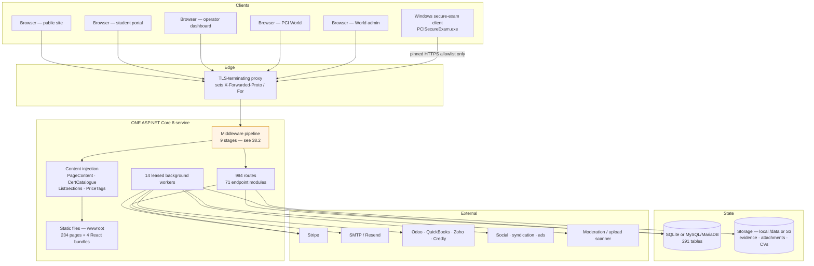

**One deployment, two brands.** `projectcontrolsinstitute.org` and PCI World are the same process and
the same database; hostname routing (`PCIWORLD_HOSTS`, `PORTAL_HOSTS`) and feature flags decide what
each request sees. The World-only image simply bakes `PCIWORLD_ONLY=true`.

### 38.2 Request lifecycle — every request, in order

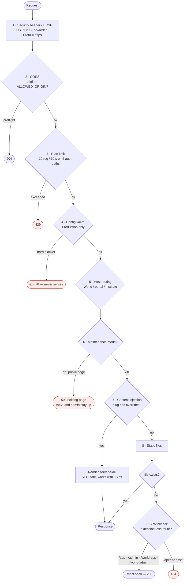

> Stage 4 is why a misconfigured production deployment **never serves a request**. That is deliberate:
> a wrong `DATABASE_FILE` would otherwise surface as silent data loss on the first redeploy.

### 38.3 Boot and deploy — including the overlap window

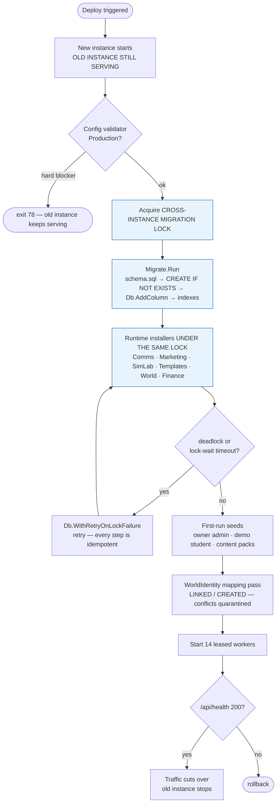

> **The overlap window is the whole reason for the lock.** A zero-downtime deploy runs two processes
> against one database. Installers catch-and-continue, so without the lock the loser does not crash —
> it abandons the rest of its upgrade and the deployment serves a half-migrated schema that fails
> later, far from the cause.

### 38.4 Student end-to-end — enquiry to credential

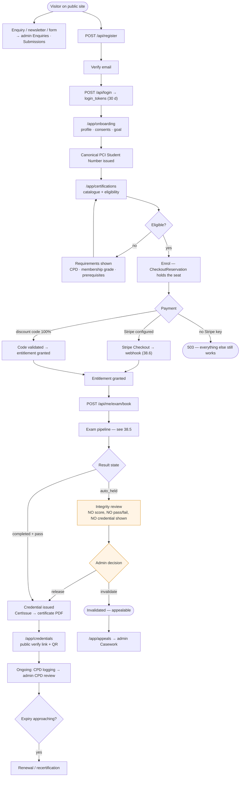

### 38.5 Examination end-to-end — booking to graded result

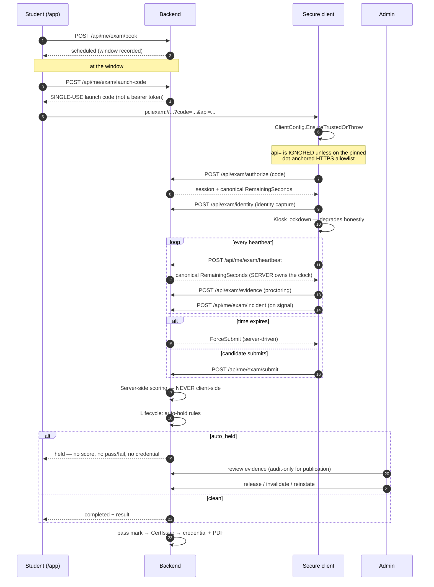

### 38.6 Payment and webhook — with the idempotency gate

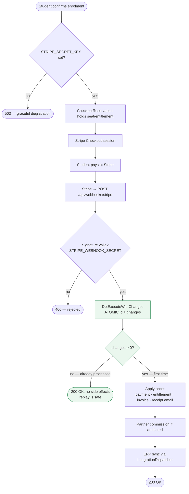

> `STRIPE_WEBHOOK_SECRET` is a **hard boot blocker** once `STRIPE_SECRET_KEY` is set — an unverified
> webhook endpoint is an open door to granting entitlements.

### 38.7 PCI World end-to-end — account to verified Passport

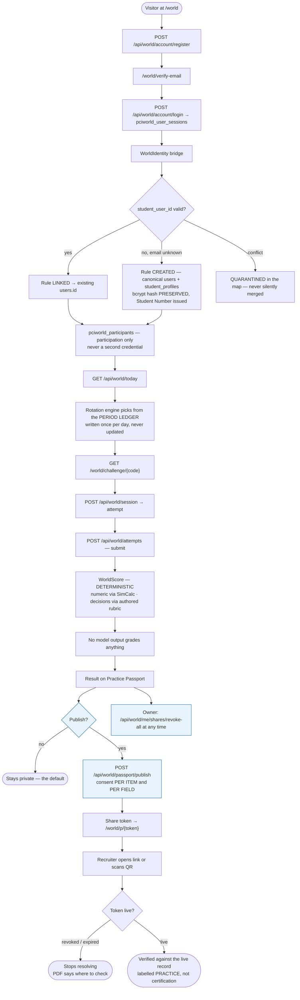

### 38.8 Community message end-to-end — the safety path

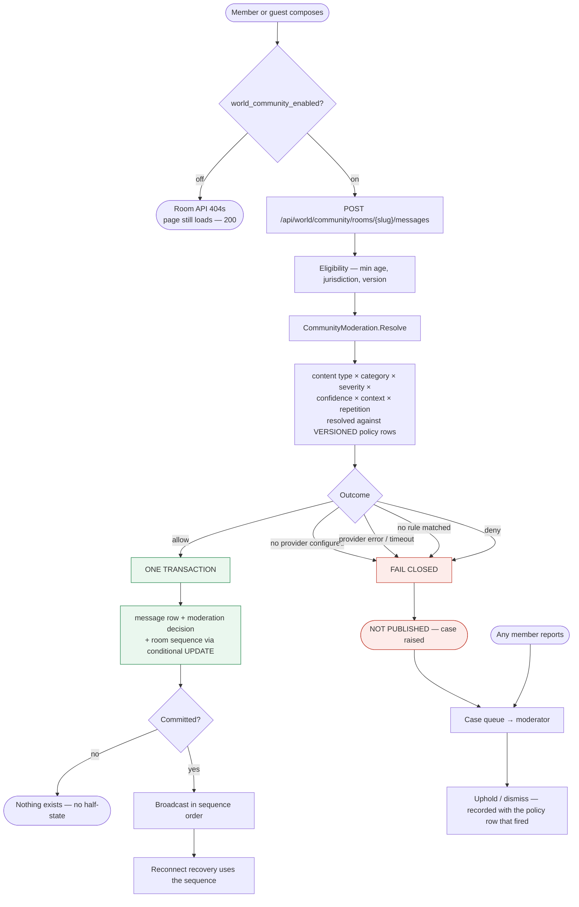

> **Which policy row fired is recorded.** That is what makes "why was this blocked in March?"
> answerable against the policy that was actually live then, and what lets a safety lead restage
> thresholds without a deploy.

**Images** (`pciworld_community_images_enabled`, depends on rooms) insert a hold-and-scan stage before
any other person sees the file — nothing is broadcast on upload.

### 38.9 Careers end-to-end — employer and candidate

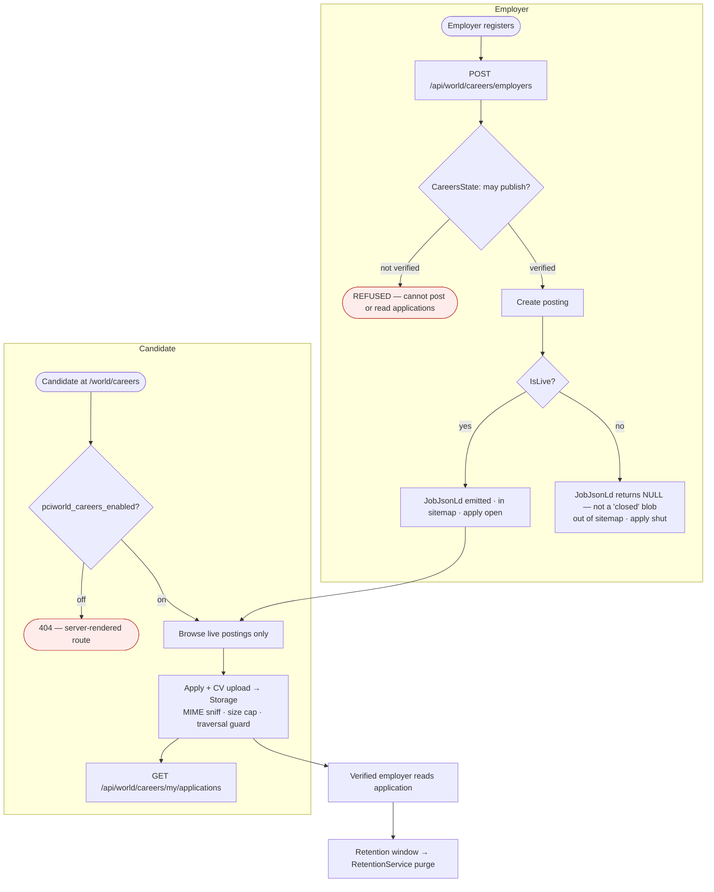

> **Verify-before-publish is not anti-spam.** A fake employer is a data-harvesting attack, and the
> window between publish and takedown is exactly the window in which CVs arrive. The question is
> re-asked at the transition **and at every read**.

### 38.10 Contributor and editorial end-to-end — the two-person rule

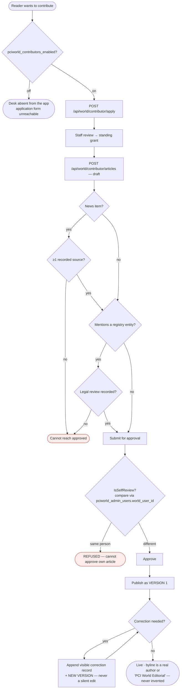

> **Why the namespace matters.** A contributor is a `pciworld_users` row; a staff editor is a
> `pciworld_admin_users` row. The id spaces are **disjoint**, so a naive `author_id == admin_id`
> check could never fire for a contributor's manuscript — a staff editor who was also the contributor
> would sail straight through. `IsSelfReview` compares in the namespace where it means something.
>
> Stated plainly rather than implied away: an admin whose `world_user_id` link is unset and who
> quietly holds a second Passport account **defeats this**. Code cannot prove two accounts are one
> person when nobody has said so. That residue belongs to conflict-of-interest policy.

### 38.11 Launch gating — what a POST to the launch board actually does

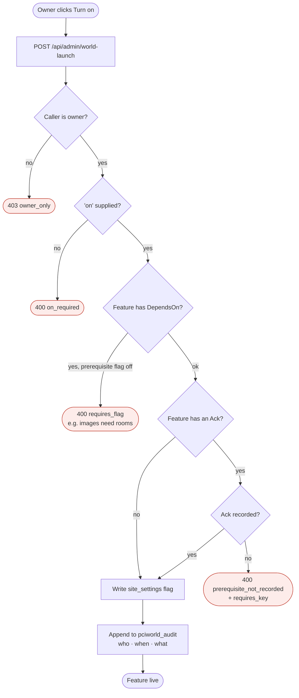

> **The refusal lives in the server, on the POST.** Anyone can curl this API; a UI that merely greys
> out a button is not a control.

### 38.12 Authentication — four consoles, no bleed

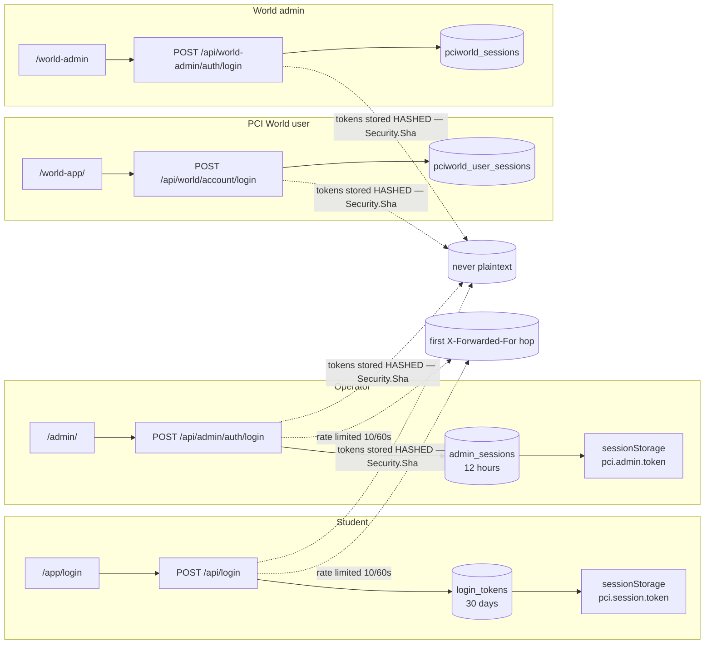

Signing into one console does **not** sign you into another: separate endpoints, separate tables,
separate storage keys, separate 401 handlers. Logout deletes the row rather than just dropping the
client copy.

### 38.13 Data lifecycle — subject access and erasure

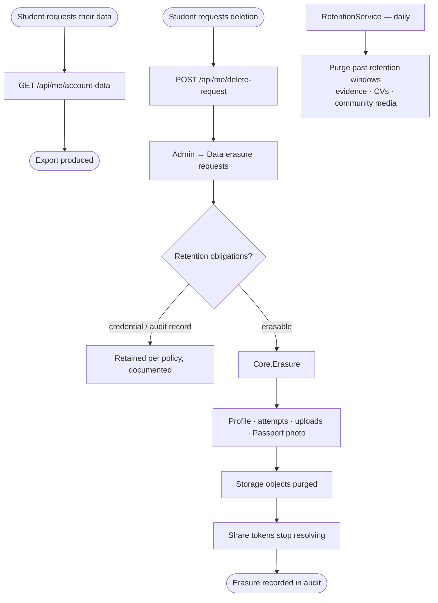

---

## 44. End-to-end checklists

Two ordered walkthroughs. If you are taking this live for the first time, follow §39.1 top to bottom.

### 39.1 Zero to live

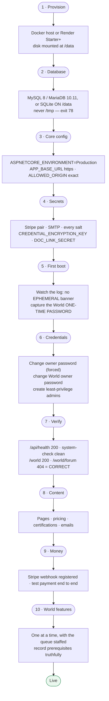

### 39.2 Change → merged, the loop CI enforces

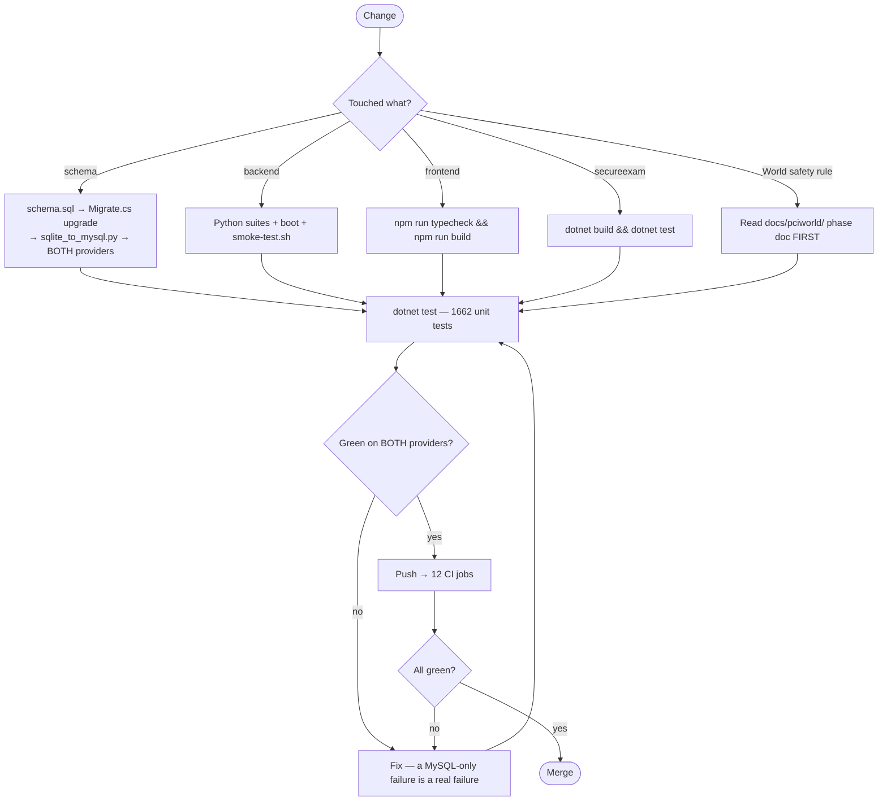

---

*Written from the source. Where a rule is stated as enforced "in the endpoint" or "in SQL", that is
what the code does — the phase documents in `docs/pciworld/` explain why it was put there.*
