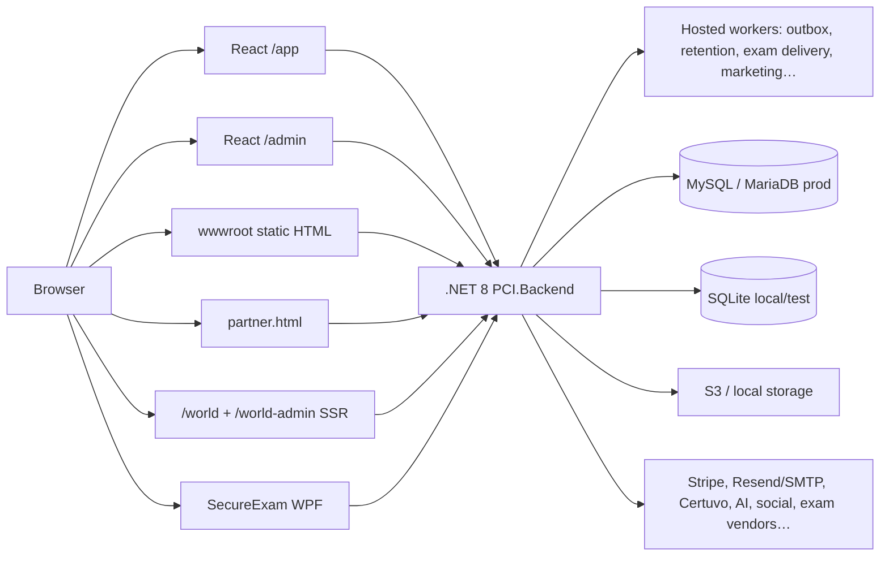

# PCI Complete Platform Audit — Phase 0 Inventory & Architecture Verification

> Phase 1's deep re-run supersedes the PCI World zero-config and production-environment conclusions
> below. The dedicated World image now requires MySQL, and framework-default Production,
> `DOTNET_ENVIRONMENT=Production`, and Staging fail closed before DB open.

**Date:** 2026-07-25 · **Branch:** `cursor/platform-audit-phase0-d975` · **Method:** concurrent code inspection of the live repository (not documentation claims). Status vocabulary: **verified**, **partially verified**, **failed**, **blocked**, **not implemented**.

---

## 1. Executive summary

The platform is a **single .NET 8 backend** serving:

| Surface | Implementation | Status |
|---------|----------------|--------|
| Public website (projectcontrolsinstitute.org) | Static HTML under `backend/wwwroot/` + server-rendered cert/catalogue fragments | **verified** (served) |
| Student portal (mypci.org `/app`) | React 18 + TypeScript SPA | **verified** |
| Main admin console (`/admin`) | React 18 + TypeScript SPA | **verified** |
| Secure exam desktop client | WPF .NET (`secureexam/`) | **verified** |
| Simulation Lab (student + admin) | React pages + .NET SimLab endpoints | **verified** |
| PCI World public + student + admin | **Server-rendered HTML** (`WorldPages` / `WorldAdmin`), not React SPAs | **partially verified** — product exists; React requirement **not met** for World UI |
| Marketing/Training Partner portal | Legacy static `partner.html` | **partially verified** — finance ledger in .NET; UI not React |
| Free Templates Library | React `/app/templates` + admin Templates | **verified** |

**Persistence:** dual-provider `Db` layer. Production Render config sets MySQL. **Active SQLite paths remain** for local/dev, unit tests, default Playwright E2E, and PCI World Docker zero-config. Phase 0 remediations in this branch close the worst production fail-open gaps and add a gating `e2e-mysql` CI job.

**Production-readiness (Phase 0 only):** **Not Ready** for a claim of “100% MySQL-only / 100% React frontends.” Critical Institute student/admin journeys are React+.NET; PCI World and Partner UIs are still non-React; SQLite remains in non-production test paths by design until Phase 1 completes.

---

## 2. Verified architecture (simplified)

---

## 3. React / .NET / MySQL compliance

### 3.1 React frontends

| App | Entry | Verified |
|-----|-------|----------|
| Student portal | `frontend/src/main.tsx`, base `/app/` | **verified** |
| Admin console | `frontend/src/admin/main.tsx`, base `/admin/` | **verified** |
| Templates (student/admin) | `pages/Templates.tsx`, `admin/pages/Templates.tsx` | **verified** |
| SimLab | `Lab.tsx`, `LabRunner.tsx`, `admin/pages/SimLab.tsx` | **verified** |
| PCI World public/student/admin | `Core/WorldPages.cs`, `Endpoints/WorldAdmin.cs` SSR | **failed** vs React requirement |
| Partner portal | `wwwroot/partner.html` | **failed** vs React requirement |
| Legacy student exam shell | `wwwroot/student.html` (still used by lifecycle E2E) | **partially verified** — intentional secure-runner bridge |

### 3.2 .NET backends

| Service | Verified |
|---------|----------|
| `PCI.Backend` minimal APIs + workers | **verified** |
| `PCI.SecureExam.Server` + WPF client | **verified** |
| Python under `backend/tests/` | **verified** as **test harness only** (not production business logic) |

### 3.3 MySQL-only persistence

| Path | Status |
|------|--------|
| Render `render.yaml` `DB_PROVIDER=mysql` | **verified** |
| Production `ConfigIssues` MySQL hard-fail | **verified** (post-Build) |
| **Pre-open production fail-closed** (this branch) | **verified** after fix |
| `/data` auto-adopting `pci.db` when MySQL selected | **FIXED** this branch |
| CI `backend` + unit + default `e2e` on SQLite | **verified** (still active) |
| CI `backend-mysql` + new `e2e-mysql` | **verified** / **added** |
| PCIWorld Docker default SQLite on `/data` | **partially verified** — allowed only with `PCIWORLD_ALLOW_SQLITE` + absolute path in production |

---

## 4. Product / route inventory (high level)

Full per-route matrix continues in `docs/testing/REQUIREMENT_TRACEABILITY_MATRIX.md` and will be expanded in Phase 2+. Phase 0 confirmed presence of:

- Public: 200+ `wwwroot/*.html` pages, cert catalogue, verify, downloads, policies, careers, events, blog/news.
- Student React: auth, certifications, credentials, CPD, Certuvo, Lab, billing, resources, events, documents, messages, support, appeals, profile, templates.
- Admin React: full console including SimLab, Templates, Training Partners, Marketing, Exam Delivery, SEO, World **not** in main admin (separate `/world-admin`).
- PCI World: `/world*`, `/world-admin*`, `/api/world*`, `/api/world-admin*`.
- Partner: `/partner.html`, `/api/partner/*`, admin partner-finance.
- Integrations: Stripe, Resend/SMTP, Certuvo, S3, AI, social, syndication, exam vendors, analytics connectors. **Zoho/Odoo adapters: not implemented** (docs-only mentions).

---

## 5. Defect register additions (Phase 0)

| ID | Severity | Finding | Status |
|----|----------|---------|--------|
| DEF-AUDIT-01 | **P0** | `student-login.html` Sign-in navigated to `student-dashboard.html` **without** `/api/login` — unauthenticated fake “Membership active” dashboard | **FIXED** — both pages are redirect stubs to `/app/login` and `/app/`; E2E regression in `public-site.spec.ts` |
| DEF-AUDIT-02 | **P0** | Production could open/migrate SQLite **before** `ConfigIssues` hard-fail ran | **FIXED** — pre-open fail-closed in `Program.cs` |
| DEF-AUDIT-03 | **P1** | `/data` auto-set `DATABASE_FILE=/data/pci.db` even when `DB_PROVIDER=mysql` | **FIXED** — only for non-MySQL providers |
| DEF-AUDIT-04 | **P1** | Browser E2E only exercised SQLite (`e2e_ci.db`) | **FIXED** (gating path added) — `e2e-mysql` CI job + Playwright `E2E_DB_PROVIDER` |
| DEF-AUDIT-05 | **P1** | PCI World UI is server-rendered HTML, not React/TypeScript | **OPEN** — product works; React migration is Phase 6 |
| DEF-AUDIT-06 | **P1** | Partner portal UI is legacy HTML, not React | **OPEN** — finance ledger is .NET; UI migration Phase 4 |
| DEF-AUDIT-07 | **P2** | Exam lifecycle E2E still depends on legacy `student.html` runner | **OPEN** — bridge retained until React exam shell exists |
| DEF-AUDIT-08 | **P2** | Hard-coded cert IDs 1/2/3 in SimLab filter labels | **OPEN** — prefer `/api/certifications` |
| DEF-2 | Medium | Retake wait never persisted | **OPEN** (pre-existing) |
| DEF-13 | High | Live external provider sandboxes not claimed | **OPEN** (external) |
| DEF-14 | Medium | `audit_logs.user_id` dual-actor schema limit | **OPEN** (pre-existing) |

---

## 6. Files changed in this Phase 0 remediation slice

- `backend/Program.cs` — pre-DB production MySQL guard; `/data` SQLite path only when not MySQL
- `backend/Core/Redirects.cs` — noindex private paths for legacy student pages
- `backend/wwwroot/student-login.html` — redirect stub
- `backend/wwwroot/student-dashboard.html` — redirect stub
- `frontend/playwright.config.ts` — optional MySQL webServer env
- `frontend/e2e/public-site.spec.ts` — auth-bypass regression
- `.github/workflows/build.yml` — `e2e-mysql` job
- `docs/audit/PHASE_0_PLATFORM_AUDIT_2026-07-25.md` — this report
- `docs/testing/DEFECT_REGISTER.md` — new DEF-AUDIT rows

---

## 7. Test evidence (this slice)

| Suite | Result |
|-------|--------|
| `dotnet build` backend | run in CI / local |
| Playwright assertion: legacy student pages → `/app` | added |
| Full CI including new `e2e-mysql` | pending on PR |

---

## 8. Phase progression plan

| Phase | Focus | Gate |
|-------|-------|------|
| **0** | Inventory + P0 fail-open / auth-bypass | this PR |
| **1** | MySQL-default tests; retire silent SQLite defaults in staging docs; money DECIMAL parity | **done** — see `PHASE_1_MYSQL_MONEY_PARITY_2026-07-25.md` |
| **2** | Public + student critical journeys re-verified on MySQL E2E | |
| **3** | Exam/credential isolation for PCL/PFL/PML | |
| **4** | Admin + partner React migration / finance maker-checker E2E | |
| **5** | SimLab depth | |
| **6** | PCI World React migration + Passport/scheduler | |
| **7–9** | Integrations, a11y, perf, SEO, release | |

---

## 9. Production-readiness recommendation (Phase 0)

**Do not claim full-platform completion.** Ship the P0 remediations. Continue Phase 1 MySQL test dominance and Phase 6/4 React migrations for World/Partner before declaring stack compliance against the master prompt’s Definition of Done.
